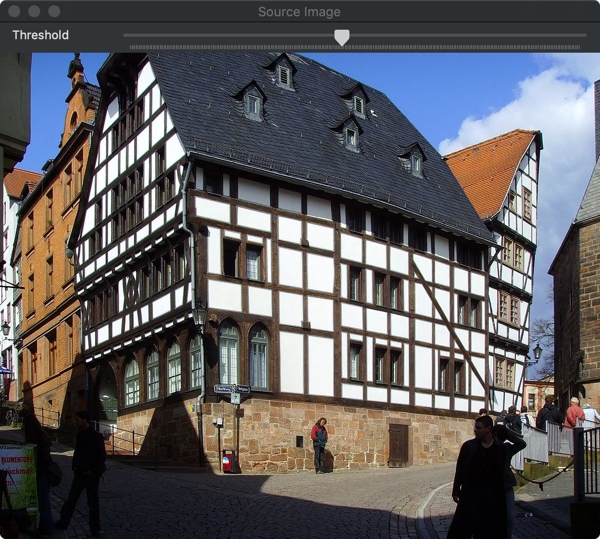
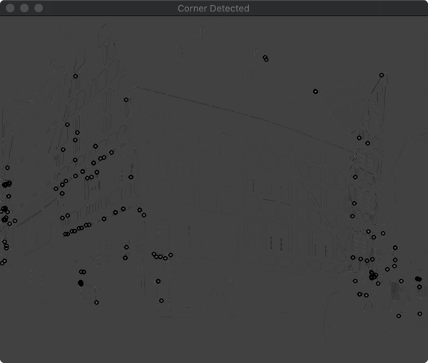

# Harris角点检测
## 学习目标
- 什么是角点？
- 角点的重要性
- 如何根据Harris-Stephens理论使用[cv::cornerHarris](https://docs.opencv.org/4.1.2/dd/d1a/group__imgproc__feature.html#gac1fc3598018010880e370e2f709b4345)方法进行角点检测。

## 理论
### 什么是角点?
- 在CV中，通常需要找到统一拍摄对象的不同照片中的匹配点。为什么呢？如果我们知道了两张不同的照片的管理关系，我们就可以将这两张照片提取到的信息结合在一起使用了。
- 一般情况下，**matching points(匹配点)**是指场景中可以很容是识别出的**特征点-characteristics**。我们可以把这些特征点称之为图像的**特征(features)**.
- 图像的特征必须具有唯一可识别性

### 图像特征的类型
图像的特征一般有以下几类:
- 边缘(Edges)
- 角点(Corners,也被称之为兴趣点或者关键点)
- Blobs(也就是兴趣区域)

### 为什么角点为此特殊？
由于焦点是两个边缘的交叉部分，它表示了两个边缘方向发生变化的点。因此，可是使用图像梯度发生明显变动的方法检测角点。

### Harris方法检测角点
- 查找角点。由于角点部位图像的梯度发生明显的变动，所以我们需要查找图像梯度发生明显变动的点。
- 假设图像$$I$$,是所有$$w(x,y)$$的窗口扫描图像$$I$$,其中$$x$$方向的位移使用$$u$$表示，$$y$$方向上的位移使用$$v$$表示，图像的强度变为可是使用下面的公式表示：
    $$
        E(u,v) = \sum_{x,y}{w(x, y)[I(x+u, y+v)-I(x, y)]^2}
    $$  
    其中:
    - $$w(x,y)$$是在位置$$(x, y)$$的窗口
    - $$I(x,y)$$是图像$$(x, y)$$位置的像素强度值
    - $$I(x+u, y+v)$$表示移动的窗口$$(x+u, y+v)$$位置的像素值
- 由于我们在寻找有角点的窗口，也就是需要找寻变化值比较大的窗口。因此必须最大化上面的方程：
    $$
        \sum_{x,y}{[I(x+u, y+v)-I(x, y)]^2}
    $$
- 使用泰勒展开：
    $$
         E(u,v) \approx \sum_{x,y}{[I(x, y) + uI_x + vI_y -I(x, y)]^2}
    $$
- 展开方程:
    $$
         E(u,v) \approx \sum_{x,y}{u^2{I_x}^2 + 2uvI_x I_y + v^2 {I_y}^2 }
    $$
- 使用矩阵表示：
    $$
        E(u,v) \approx 
        \begin{bmatrix}
        u & v 
        \end{bmatrix}
        \Bigg(
            \sum_{x,y}{ w(x, y)
                        \begin{bmatrix}
                            {I_x}^2 & I_x I_y \\
                            I_x I_y & {I_y}^2
                        \end{bmatrix}
                       }
        \Bigg)
        \begin{bmatrix}
                u \\
                v 
        \end{bmatrix}
    $$
- 变换矩阵记为$$M$$:
    $$
        M = \sum_{x,y}{ w(x, y)
                          \begin{bmatrix}
                           {I_x}^2 & I_x I_y \\
                           I_x I_y & {I_y}^2
                           \end{bmatrix}
                       }
    $$
- 则方程可以表示为: 
    $$
            E(u,v) \approx 
            \begin{bmatrix}
            u & v 
            \end{bmatrix}
            M
            \begin{bmatrix}
                    u \\
                    v 
            \end{bmatrix}
        $$
- 通过计算每个窗口的得分来判断窗口内是否包含角点:  
    $$
        R = \det {M} - k(trace(M))^2
    $$  
    其中:
    - $$\det (M) = {\lambda}_1 {\lambda}_2$$
    - $$trace(M) = {\lambda}_1 + {\lambda}_2$$
    
    得分R大于特定值的窗口被视为“角点”
    
## 示例代码

[import](../../src/ProjectsCpp/2DFeatures/HarrisCornerDetector/2d_features_harris_corner_detector.cpp)

