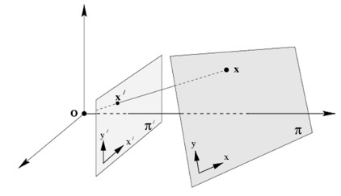
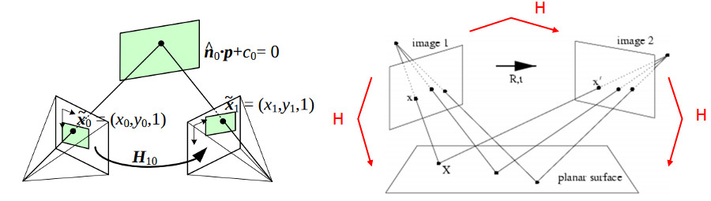
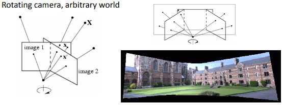
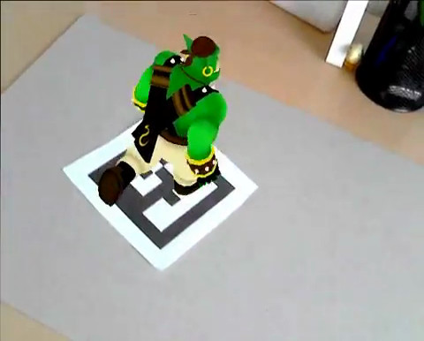
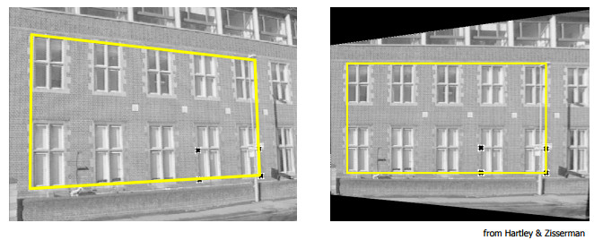
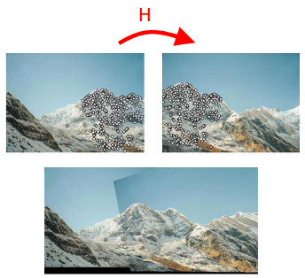
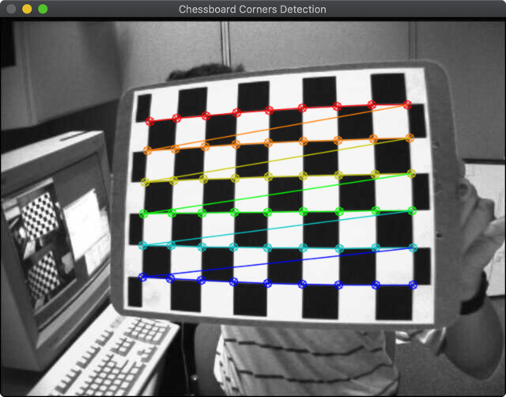
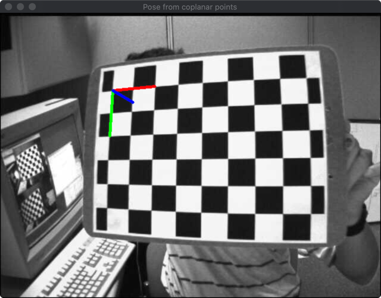
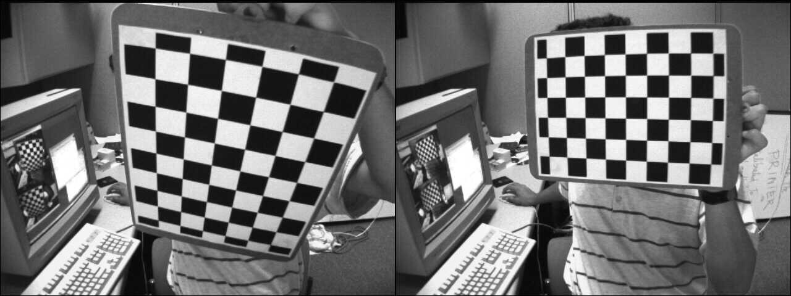

# Homography的基本概念
[原文](https://docs.opencv.org/4.1.2/d9/dab/tutorial_homography.html)
## 什么是单应矩阵(homography matrix)？
简而言之，平面单应性涉及两个平面之间的变换（最大比例因子）：
$$
s \begin{bmatrix} x^{'} \\ y^{'} \\ 1 \end{bmatrix} = H \begin{bmatrix} x \\ y \\ 1 \end{bmatrix} = \begin{bmatrix} h_{11} & h_{12} & h_{13} \\ h_{21} & h_{22} & h_{23} \\ h_{31} & h_{32} & h_{33} \end{bmatrix} \begin{bmatrix} x \\ y \\ 1 \end{bmatrix}
$$

单应性矩阵是一个`3x3`矩阵，但只具有8DoF（自由度），因为它估计到一个比例。通常使用$$h_{33} = 1$$或$$h_{11}^2 + h_{12}^2 + h_{13}^2 + h_{21}^2 + h_{22}^2 + h_{23}^2 + h_{31}^2 + h_{32}^2 + h_{33}^2 = 1$$来对矩阵进行泛化。

以下示例显示了不同类型的变换，但都与两个平面之间的变换有关。

- 平面和像平面

    <div style="text-align: center">
        
        <h6>平面和像平面</h6>
    </div>

- 两个摄像机位置视角的平面

    <div style="text-align: center">
        
        <h6>两个摄像机位置视角的平面</h6>
    </div>

- 围绕其投影轴旋转的摄像头，相当于认为这些点位于无限远的平面上

    <div style="text-align: center">
        
        <h6>围绕其投影轴旋转的摄像头</h6>
    </div>

## 单应变换有什么应用？
- 从共面点进行相机姿态估计，例如使用标记增强现实

    <div style="text-align: center">
        
        <h6></h6>
    </div>

- 透视移除及矫正

    <div style="text-align: center">
        
        <h6></h6>
    </div>

- 全景图拼接

    <div style="text-align: center">
        
        <h6></h6>
    </div>

## 应用
### 1.使用共面点进行姿态估计
**注意:**
> 从单应性估计相机姿势的代码是一个示例，如果要估计平面或任意对象的相机姿势，则应改用[`cv::solvePnP`](https://docs.opencv.org/4.1.2/d9/d0c/group__calib3d.html#ga549c2075fac14829ff4a58bc931c033d)

可以使用DLT(Direct Linear Transform)算法估计homography变换。关于观察对象是一个平面，所以泛化的摄像机图像帧里面的对象帧上的点和像平面上的投影点是单应性的。**只有当对象是个平面的时候，假定知道了摄像头的内参，才能使用homography变换求解摄像头的姿态。**可以简单的使用棋盘格和[`findChessboardCorners()`](https://docs.opencv.org/4.1.2/d9/d0c/group__calib3d.html#ga93efa9b0aa890de240ca32b11253dd4a)方法获取图像上的角点坐标。

在使用棋盘格进行摄像头的位置姿态估计的时候，我们需要首先获取摄像头的内部参数和畸变参数，以及棋盘格的数据：

OpenCV演示例子提供其棋盘格图片以及棋盘格数据信息和拍摄的摄像头的数据信息:  


[import](../../src/ProjectsCpp/2DFeatures/HomographyConcenpts/Resources/left_intrinsics.yml)

#### 1.1 检测图片的棋盘格角点

```c++
// region 检测角点
    Mat imgGray;
    cvtColor(img, imgGray, COLOR_BGR2GRAY);
    // 棋盘格的角点
    vector<Point2f> corners;
    // 计算并绘制棋盘格的角点
    clock_t start = clock();
    bool found = findChessboardCorners(imgGray, patternSize, corners);
    double time = double(clock()-start)/CLOCKS_PER_SEC;
    cout << "检测角点耗时 : " << int(time*1000) << " 微秒"<< endl;

    if (!found){
        cout << "未能检测到棋盘格角点!" << endl;
        return;
    }
    drawChessboardCorners(img_corners, patternSize, corners, found);
    imshow("Chessboard Corners Detection", img_corners);
    //endregion
```
**PS：OpenCV的`findChessboardCorners()`方法，如果图像中不存在棋盘格的话，十分的慢，但是存在的话几乎是毫秒级的响应**




#### 1.2 计算对象的点
在知道棋盘格的尺寸之后，计算对象帧里面表述的对象的点事十分简单的：  

```c++
//! [计算棋盘格对象的点]
for (int i = 0; i < boardSize.height; ++i) {
    for (int j = 0; j < boardSize.width; ++j) {
         orners.push_back(Point3f(float(j*squareSize), float(i*squareSize), 0));
    }
}
//! [计算棋盘格对象的点]
```

在进行homography估计的时候一定要移除对象点的`z=0`坐标：  

```c++
    //! [计算对象点]
    vector<Point3f> objectPoints;
    calcChessboardCorners(patternSize, squareSize, objectPoints, CHESSBOARD);
    // 进行homography估计的话，必须移除z轴
    vector<Point2f> objectPointsPlanar;
    for (auto & objectPoint : objectPoints) {
        objectPointsPlanar.push_back(Point2f(objectPoint.x, objectPoint.y));
    }
    //! [计算对象点]
```

#### 1.3 计算泛化摄像机的像平面的角点
使用摄像头的内参和畸变参数，对棋盘角度使用透视变换的逆变换可以计算泛化摄像机的像平面的角点。 

```c++
    //! [加载摄像机参数]
    FileStorage fs(samples::findFile(intrinsicsPath), FileStorage::READ);
    Mat cameraMatix, distCoeffs;
    fs["camera_matrix"] >> cameraMatix;
    fs["distortion_coefficients"] >> distCoeffs;
    //! [加载摄像机参数]

    //! [计算理想成像平面的点]
    vector<Point2f> imagePoints;
    undistortPoints(corners, imagePoints, cameraMatix, distCoeffs);
    //! [计算理想成像平面的点]
```

#### 1.4 使用对象平面和泛化像平面的单应性关系计算homography变换矩阵

```c++
    //! [估算homography变换矩阵]
    Mat H = findHomography(objectPointsPlanar, imagePoints);
    cout << "H:\n" << H << endl;
    //! [估算homography变换矩阵]
```

#### 1.5 从homography矩阵中提取姿态信息

```c++
    //! [提取姿态矩阵]
    // 进行归一化操作确保||c1||=1
    double norm = sqrt(H.at<double>(0,0) * H.at<double>(0,0) +
                       H.at<double>(1,0) * H.at<double>(1,0) +
                       H.at<double>(2,0) * H.at<double>(2,0));
    H /= norm;
    Mat c1  = H.col(0);
    Mat c2  = H.col(1);
    Mat c3 = c1.cross(c2);
    Mat tvec = H.col(2);
    Mat R(3, 3, CV_64F);
    for (int i = 0; i < 3; i++)
    {
        R.at<double>(i,0) = c1.at<double>(i,0);
        R.at<double>(i,1) = c2.at<double>(i,0);
        R.at<double>(i,2) = c3.at<double>(i,0);
    }
    //! [提取姿态矩阵]
```

使用数学公式表示为：  
$$
    \mathbf{X} = \left( X, Y, 0, 1 \right ) 
$$

$$
    \begin{aligned}
        \mathbf{x} &= \mathbf{P}\mathbf{X} \\
        &= \mathbf{K} \begin{bmatrix} r_1 & r_2 & r_3 & t \end{bmatrix}  \begin{bmatrix} X \\ Y \\ 0 \\ 1 \end{bmatrix} \\
        &= \mathbf{K} \begin{bmatrix} r_1 & r_2 & t \end{bmatrix}  \begin{bmatrix} X \\ Y \\  1 \end{bmatrix} \\
        &= \mathbf{H}  \begin{bmatrix} X \\ Y \\  1 \end{bmatrix}
    \end{aligned}
$$

$$
    \begin{aligned}
        \mathbf{H} &= \lambda \mathbf{K} \begin{bmatrix} r_1 & r_2 & t \end{bmatrix} \\
        \mathbf{K^{-1}} \mathbf{H} &= \lambda  \begin{bmatrix} r_1 & r_2 & t \end{bmatrix} \\
        \mathbf{P} &= \mathbf{K} \begin{bmatrix} r_1 & r_2 & (r_1 \times r_2) & t \end{bmatrix}
    \end{aligned}
$$

**PS:这种简单的处理，并不能确保旋转矩阵是正交的，缩放比例也是非常之粗糙。而使用机型分解可以获得叫个较好的旋转矩阵**  

```c++
    //! [旋转矩阵的极分解]
    cout << "R (极分解前):\n" << R << "\ndet(R): " << determinant(R) << endl;
    Mat W, U, Vt;
    SVDecomp(R, W, U, Vt);
    R = U*Vt;
    cout << "R (极分解后):\n" << R << "\ndet(R): " << determinant(R) << endl;
    //! [旋转矩阵的极分解]

    //! [显示姿态坐标轴]
    Mat rvec;
    Rodrigues(R, rvec);
    drawFrameAxes(img_pose, cameraMatix, distCoeffs, rvec, tvec, 2*squareSize);
    imshow("Pose from coplanar points", img_pose);
```

如此即可获取把对象投影到图像中的摄像机的姿态。



### 基于共面角点的homography变换的姿态估计的完整代码

[import](../../src/ProjectsCpp/2DFeatures/HomographyConcenpts/2d_features_homography_pose_from_homography.cpp)

### 2. 透视矫正(Perspective correction)

<div style="text-align: center">
    
    <h6>将左图变换到右图</h6>
</div>  

#### 2.1 检测角点

```c++
    Mat img1 = imread("Resources/left01.jpg", IMREAD_GRAYSCALE);
    Mat img2 = imread("Resources/left02.jpg", IMREAD_GRAYSCALE);
    imshow("image1", img1);
    imshow("image2", img2);

    // 检测角点
    vector<Point2f> corners1, corners2;
    Size patternSize(9,6);
    bool found1 = findChessboardCorners(img1, patternSize, corners1);
    bool found2 = findChessboardCorners(img2, patternSize, corners2);
```
#### 2.2 估算homography

```c++
// 计算homography变换矩阵
    Mat H = findHomography(corners2, corners1);
```

#### 2.3 执行变换

```c++
    Mat img2_warp;
    warpPerspective(image2Color, img2_warp, H, image1Color.size());
    imshow("image2 warped", img2_warp);
```

