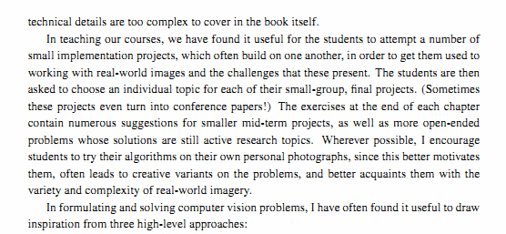
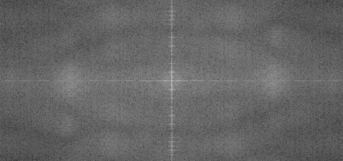
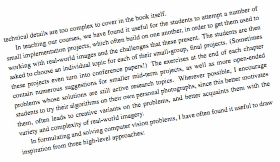
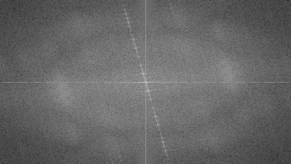

# 离散傅里叶变换(DFT)
世界的任何事物都存在波粒二现象，我们的大脑就是一个就非常善于对信号进行傅里叶变换来处理信号。  

<div style="text-align: center">
    <video width="100%" controls>
        <source src="materials/FourierTransform.mp4" type="video/mp4" />
        当前浏览器不支持视频播放，可以通过下面的链接观看
        <p><a href="https://www.youtube.com/watch?v=0LuyxzqI3Hk">Youtube</a></p>
        <p><a href="materials/FourierTransform.mp4">视频下载</a></p>
    </video>
</div>  

## 学习目标
- 什么是Fourier Transform? 有什么用？
- 如何在OpenCV中实现傅里叶变换
- 掌握[copyMakeBorder()](https://docs.opencv.org/4.1.2/d2/de8/group__core__array.html#ga2ac1049c2c3dd25c2b41bffe17658a36) , [merge()](https://docs.opencv.org/4.1.2/d2/de8/group__core__array.html#ga7d7b4d6c6ee504b30a20b1680029c7b4) , [dft() ](https://docs.opencv.org/4.1.2/d2/de8/group__core__array.html#gadd6cf9baf2b8b704a11b5f04aaf4f39d), [getOptimalDFTSize()](https://docs.opencv.org/4.1.2/d2/de8/group__core__array.html#ga6577a2e59968936ae02eb2edde5de299) , [log()]()和[normalize()](https://docs.opencv.org/4.1.2/dc/d84/group__core__basic.html#ga1b6a396a456c8b6c6e4afd8591560d80)的用法 .

## 傅里叶变换示例代码

[import](../../src/ProjectsCpp/CoreFunctions/DiscreteFourierTransform/discrete_fourier_transform.cpp)  

### 代码说明
傅立叶变换(Fourier Transform)可以将图像分解成其正弦和余弦分量, 换句话说傅里叶变换将图像从空间域转换到了频率域。傅里叶变换的核心思想是任何函数都可以用无限的正弦和余弦函数之和精确地近似表示。一个二维图像的傅里叶变换的数学表示为：  
$$
    F(k, l) = \sum_{i=0}^{N-1} \sum_{j=0}^{N-1} f(i, j)e^{-i2\pi(\frac{ki}{N}+\frac{kj}{N})}
$$
$$
    e^{ix}=\cos{x}+i\sin{x}
$$

上式中$$f$$表示图像在空间域的值，而$$F$$表示其在频率域的值。傅里叶变换的结果是一个复数，可以通过一个真实的图像(real)和一个复数图像(complex)显示变换结果，也可以通过幅值(magnitude)和相位(phase)图像进行显示。不过，在整个图像处理算法中，仅幅值图像很有趣，因为它包含了我们需要的有关图像几何结构的所有信息，不过，如果您打算以这些形式对图像进行一些修改，然后需要对其进行重新转换，则需要保留这两个图像。  
上面的示例代码演示如何计算和显示傅里叶变换的幅值图像。由于数字图像是离散的，所以我们只能在给定的值域中取值。例如对于一个基本的灰度图像，像素值的值域为[0, 255], 因此傅里叶变换也也是不连续的，所以产生了离散傅里叶变换-Discrete Fourier Transform (DFT)。只要记住当我们需要从几何角度去分析一个图像的时候我们就需要对图像进行DFT变换。  
下面是对图像image进行DFT变换的步骤：  
#### 1. 扩展图像到最优的尺寸
opencv中DFT的性能取决于图像的尺寸大小，对于图像尺寸是2， 3， 5的倍数的图像，DFT的速度非常快。因此，要获得最佳性能，通常最好为图像添加边框使得图像的尺寸具有上述特征。可是使用[getOptimalDFTSize()](https://docs.opencv.org/4.1.2/d2/de8/group__core__array.html#ga6577a2e59968936ae02eb2edde5de299)计算最佳的图像尺寸，使用[copyMakeBorder()](https://docs.opencv.org/4.1.2/d2/de8/group__core__array.html#ga2ac1049c2c3dd25c2b41bffe17658a36)来添加border。
```c++
    // 将输入图像扩大到最佳尺寸
    Mat padded;
    int m = getOptimalDFTSize(image.rows);
    int n = getOptimalDFTSize(image.cols);
    copyMakeBorder(image, padded, 0, m-image.rows, 0, n-image.cols, BORDER_CONSTANT,
            Scalar::all(0));
```
#### 2. 创建变量用于存放DFT输出的虚部和实部
傅里叶变换的结果是一个复数，这意味着一个图像经过傅里叶变换之后图像的变成了实部图像和虚部图像两个图像、而且频率域(frequency domains)的取值范围比图像的空间域(spatial)要大的多,因此存储傅里叶变换结果的矩阵的depth至少也要是float类型。因此在代码中我们将输出图像的类型转为float类型，并增加一个通道来保存变换结果的虚部：  
```c++
    Mat planes[]={Mat_<float>(padded), Mat::zeros(padded.size(), CV_32F)};
    Mat complexImage;
    // 吧一个zeros通道和扩展通道合并在一起
    merge(planes, 2, complexImage);
```
#### 3. 进行DFT变换
`cv::dft`是一个in-place方法
```c++
// dft是一个in-place操作
dft(complexImage, complexImage);
```
#### 4. 将实部和虚部的值转化为幅值
复数是有实部(real-$$Re$$)和虚部(imaginary-$$Im$$)组成的, DFT变化结果的幅值计算方法为:  
$$
    M=\sqrt[2]{Re(DFT(I))^2 + Im(DFT(I))^2}
$$

代码:  
```c++
    // 将DFT实数和虚数部分变换成幅值
    split(complexImage, planes);// planes[0]为DFT变换结果的实部，planes[1]为虚部
    magnitude(planes[0], planes[1], planes[0]);// 如此planes[0]存储的幅值大小
```
#### 5. 将幅值转换到对数空间
事实上傅里叶系数的动态范围太大了，无法在屏幕上显示， 存在一些我们无法观察到的太小和太高的值。因此将灰度图像的像素的线性空间的值转化为对数空间值，就也可以很好的观察DFT的变换结果：白色是值非常高的部分，黑色是值非常低的部分:  
$$
    M_1=\log(1+M)
$$   

```c++
    magImage += Scalar::all(1);  
    log(magImage, magImage);
```

#### 6. 对图像进行裁剪并重新排列
用于前面为了获取更好的DFT性能对图像进行了扩大处理， 所以现在需要移除增加的像素。而处于可视化的目的，需要对图像的象限重新排列，使得象限的原点正好在图像的中心。  

```c++
    // 如果图像的尺寸是奇数的话对图像进行裁剪并重新排列
    magImage = magImage(Rect(0, 0, magImage.cols & -2, magImage.rows & -2));

    // 重新排列Fourier图像的象限，使得图像的中心在象限的原点
    int cx = magImage.cols/2;
    int cy = magImage.rows/2;

    Mat q0(magImage, Rect(0,0,cx,cy));  // 左上
    Mat q1(magImage, Rect(cx, 0, cx, cy));  // 右上
    Mat q2(magImage, Rect(0, cy, cx, cy));  // 左下
    Mat q3(magImage, Rect(cx, cy, cx, cy));     // 右下

    Mat tmp;    //交换象限 (左上与右下交换)
    q0.copyTo(tmp);
    q3.copyTo(q0);
    tmp.copyTo(q3);

    //交换象限 (右上与左下)
    q1.copyTo(tmp);
    q2.copyTo(q1);
    tmp.copyTo(q2);
```  

#### 7. 归一化(Normalize)
这一步的操作完全是为了图像的现实。虽然将傅里叶系数转为为了幅度，但是幅度的值仍然超出了我们现实图像使用的[0,1]范围，使用`cv::normalize`对幅度值进行归一化。  

```c++
    // 将幅度矩阵转化为0~1之间的浮点型数据方便显示
    normalize(magImage, magImage, 0, 1, NORM_MINMAX);
```
## 总结
Fourier变换的用处十分广泛，比如我们可以用来检验图像中的几何朝向信息。例如图片中的文字，本行也以水平线的形式出现，字母则以垂直线的形式出现，在傅立叶变换下，也可以看到文本片段的这两个主要组成部分：  

<div style="text-align: center;">
    
    
    <h6>水平方向</h6>
</div>  

<div style="text-align: center;">
    
    
    <h6>文字旋转</h6>
</div>  

从Fourier变换的频域图像上可以看出频域中最具影响力的部分（幅度图像上最亮的点）跟随图像上对象的几何旋转， 据此，我们可以计算偏移量并执行图像旋转以校正图像。


