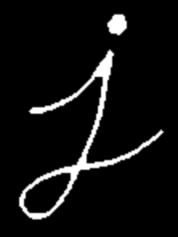

# 图像的腐蚀和膨胀运算(Eroding and Dilating)
官方文档地址:https://docs.opencv.org/4.1.2/d3/dbe/tutorial_opening_closing_hats.html
图像的腐蚀(Erosion)和膨胀(Dialation)是图像最基本也是最常见的形态学运算，可是使用opencv的`cv::erode`和`cv::dialte`分别实现。

## Morphological Operations 形态学操作
形态学运算是图像处理中最基础也是最重要的运算，而形态学运算的基础就是Erosion和Dilation，这两种运算拥有非常广泛的用途：  
- 去除噪声
- 隔离图像中的单个元素或连接图像中的单个元素
- 找出图像中的颠簸(bumps)区域和孔洞区域(holes)

使用下面的图片进行演示：  
    

## Dilate 膨胀
- 膨胀操作就是把图像A与核B进行卷积，计算核B中非0像素所经过的区域最大值，并把最大值赋值个核B的锚点区域。所以进行膨胀操作，图像的白色部分增多了，故称之为膨胀。  
    $$
        dst(x, y) = \max(x', y')_{: element(x', y')\neq0}src(x+x', y+y')
    $$
- 图像dilate运算后， 图像中的白色区域变大了：  
    

## Erosion 腐蚀
- 腐蚀操作与膨胀相反，把图像A与核B进行卷积，计算核B中非0像素所经过的区域最小值，并把最小值赋值个核B的锚点区域。所以进行腐蚀操作，图像的黑色部分增多了， 白色区域减小，故称之为腐蚀。
    $$
        dst(x, y) = \min(x', y')_{: element(x', y')\neq0}src(x+x', y+y')
    $$
- 突进进行erode运算后，图像中的白色区域减小了：  
    
