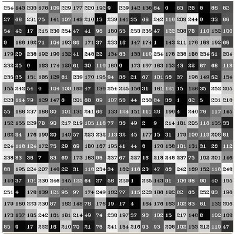
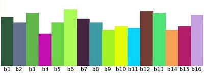
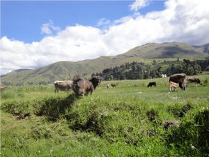
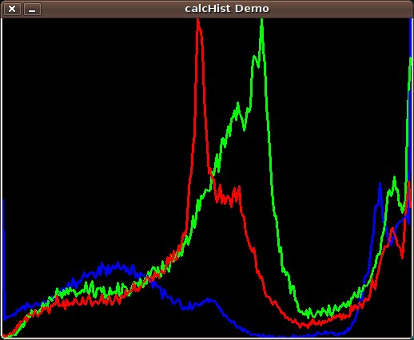

# 直方图计算(Histogram Calculation)
## 学习目标
- 使用`cv::split`拆分图像的通道
- 使用`cv::calcHist`计算直方图
- 使用`cv::normalize`归一化数组

## 什么是直方图?
- 直方图是表示预定义在bin中的数据再图像中的个数
- 这里所指的数据不仅仅是像素的强度(在上一节[直方图均衡化](../HistogramEqualization/HistogramEqualization.md)中我们主要探讨的是像素的强度)。直方图分析的数据可以是任何图像中用于描述图像信息的数据。
- 下面的例子中，将图像的信息(像素值)描述为一个矩阵：
<div align="center">
    
</div>

- 像素值为[0~255]共256个数字，如果我们每把这个数字划分为一个一个小区间(在OpenCV中成为**bins**)，让后记录图像中的像素在每个小区间的个数，其结果就是图像的直方图。
$$
    [0, 255] = [0, 15] \cup [16, 31] \cup ... \cup [240, 255]
$$

$$
    range = bin_1 \cup bin_2 \cup bin_3 \cup ... \cup bin_{n=16}
$$
把结果用图像表示，就得到如下的图像:
<div align="center">
    
</div>

- 上面的例子只是一种简单的直方图的应用，其中直方图的数据采用的是图片的像素值，实际上直方图的数据可以是图像的任何数据。
- 直方图的数据组成主要用： 
    1. **dims**：想要收集的数据的个数。例如上面的例子中，**dims=1**是因为只计算灰度图像中的每个像素的值；
    2. **bins**:每个dim细分的数量，在上例中**bins**=16
    3. **range**:测量值的方位，上例中**range**=[0, 255]

- 试想如果需要考虑中的特征(feature)有2个，直方图是个什么样子？ 
    > 此时，得到的其实一个3D的直方图($$x$$和$$y$$轴分别表示不同维度的$$bin_x$$和$$bin_y$$，$$z$$轴表示$$(bin_x, bin_y)$$的值)，以此类推可以推广到更多的特性

## `cv::calcHist`
OpenCV提供的`cv::calcHist`方法可以计算一组数组（通常是图片或者图像的通道数据）的直方图。该方法可以最多完成32个维度的计算

## 演示代码
代码总览：
- 加载图片
- 用`cv::split`把图像拆分为R,G,B通道
- 用`cv::calcHist`计算每个通道的直方图
- 显示直方图

### C++
```c++
#include "opencv2/highgui.hpp"
#include "opencv2/imgcodecs.hpp"
#include "opencv2/imgproc.hpp"
#include <iostream>
using namespace std;
using namespace cv;
int main(int argc, char** argv)
{
    CommandLineParser parser( argc, argv, "{@input | lena.jpg | input image}" );
    Mat src = imread( samples::findFile( parser.get<String>( "@input" ) ), IMREAD_COLOR );
    if( src.empty() )
    {
        return EXIT_FAILURE;
    }
    vector<Mat> bgr_planes;
    split( src, bgr_planes );
    int histSize = 256;
    float range[] = { 0, 256 }; //the upper boundary is exclusive
    const float* histRange = { range };
    bool uniform = true, accumulate = false;
    Mat b_hist, g_hist, r_hist;
    calcHist( &bgr_planes[0], 1, 0, Mat(), b_hist, 1, &histSize, &histRange, uniform, accumulate );
    calcHist( &bgr_planes[1], 1, 0, Mat(), g_hist, 1, &histSize, &histRange, uniform, accumulate );
    calcHist( &bgr_planes[2], 1, 0, Mat(), r_hist, 1, &histSize, &histRange, uniform, accumulate );
    int hist_w = 512, hist_h = 400;
    int bin_w = cvRound( (double) hist_w/histSize );
    Mat histImage( hist_h, hist_w, CV_8UC3, Scalar( 0,0,0) );
    normalize(b_hist, b_hist, 0, histImage.rows, NORM_MINMAX, -1, Mat() );
    normalize(g_hist, g_hist, 0, histImage.rows, NORM_MINMAX, -1, Mat() );
    normalize(r_hist, r_hist, 0, histImage.rows, NORM_MINMAX, -1, Mat() );
    for( int i = 1; i < histSize; i++ )
    {
        line( histImage, Point( bin_w*(i-1), hist_h - cvRound(b_hist.at<float>(i-1)) ),
              Point( bin_w*(i), hist_h - cvRound(b_hist.at<float>(i)) ),
              Scalar( 255, 0, 0), 2, 8, 0  );
        line( histImage, Point( bin_w*(i-1), hist_h - cvRound(g_hist.at<float>(i-1)) ),
              Point( bin_w*(i), hist_h - cvRound(g_hist.at<float>(i)) ),
              Scalar( 0, 255, 0), 2, 8, 0  );
        line( histImage, Point( bin_w*(i-1), hist_h - cvRound(r_hist.at<float>(i-1)) ),
              Point( bin_w*(i), hist_h - cvRound(r_hist.at<float>(i)) ),
              Scalar( 0, 0, 255), 2, 8, 0  );
    }
    imshow("Source image", src );
    imshow("calcHist Demo", histImage );
    waitKey();
    return EXIT_SUCCESS;
}
```
### python
```python
from __future__ import print_function
from __future__ import division
import cv2 as cv
import numpy as np
import argparse
parser = argparse.ArgumentParser(description='Code for Histogram Calculation tutorial.')
parser.add_argument('--input', help='Path to input image.', default='lena.jpg')
args = parser.parse_args()
src = cv.imread(cv.samples.findFile(args.input))
if src is None:
    print('Could not open or find the image:', args.input)
    exit(0)
bgr_planes = cv.split(src)
histSize = 256
histRange = (0, 256) # the upper boundary is exclusive
accumulate = False
b_hist = cv.calcHist(bgr_planes, [0], None, [histSize], histRange, accumulate=accumulate)
g_hist = cv.calcHist(bgr_planes, [1], None, [histSize], histRange, accumulate=accumulate)
r_hist = cv.calcHist(bgr_planes, [2], None, [histSize], histRange, accumulate=accumulate)
hist_w = 512
hist_h = 400
bin_w = int(round( hist_w/histSize ))
histImage = np.zeros((hist_h, hist_w, 3), dtype=np.uint8)
cv.normalize(b_hist, b_hist, alpha=0, beta=hist_h, norm_type=cv.NORM_MINMAX)
cv.normalize(g_hist, g_hist, alpha=0, beta=hist_h, norm_type=cv.NORM_MINMAX)
cv.normalize(r_hist, r_hist, alpha=0, beta=hist_h, norm_type=cv.NORM_MINMAX)
for i in range(1, histSize):
    cv.line(histImage, ( bin_w*(i-1), hist_h - int(round(b_hist[i-1])) ),
            ( bin_w*(i), hist_h - int(round(b_hist[i])) ),
            ( 255, 0, 0), thickness=2)
    cv.line(histImage, ( bin_w*(i-1), hist_h - int(round(g_hist[i-1])) ),
            ( bin_w*(i), hist_h - int(round(g_hist[i])) ),
            ( 0, 255, 0), thickness=2)
    cv.line(histImage, ( bin_w*(i-1), hist_h - int(round(r_hist[i-1])) ),
            ( bin_w*(i), hist_h - int(round(r_hist[i])) ),
            ( 0, 0, 255), thickness=2)
cv.imshow('Source image', src)
cv.imshow('calcHist Demo', histImage)
cv.waitKey()
```
### 代码解读-C++
- 加载图片
```c++
    CommandLineParser parser( argc, argv, "{@input | lena.jpg | input image}" );
    Mat src = imread( samples::findFile( parser.get<String>( "@input" ) ), IMREAD_COLOR );
    if( src.empty() )
    {
        return EXIT_FAILURE;
    }
```
- 拆分通道
```c++
    vector<Mat> bgr_planes;
    split( src, bgr_planes );
```
- 为每个通道的histograms计算进行配置。由于是在B，G，R通道上进行计算，所以矩阵中每个元素的取值访问是[0, 255]
- 确定bins的数量
```c++
    int histSize = 256;
```
- 设定值的取值范围:
```c++
    float range[] = { 0, 256 }; //the upper boundary is exclusive
    const float* histRange = { range };
```
- 我们想要使得bins数量相同，以清除开头的直方图：
```c++
    bool uniform = true, accumulate = false;
```
- 使用[cv::calcHist](https://docs.opencv.org/4.1.2/d6/dc7/group__imgproc__hist.html#ga4b2b5fd75503ff9e6844cc4dcdaed35d)开始计算
```c++
    Mat b_hist, g_hist, r_hist;
    calcHist( &bgr_planes[0], 1, 0, Mat(), b_hist, 1, &histSize, &histRange, uniform, accumulate );
    calcHist( &bgr_planes[1], 1, 0, Mat(), g_hist, 1, &histSize, &histRange, uniform, accumulate );
    calcHist( &bgr_planes[2], 1, 0, Mat(), r_hist, 1, &histSize, &histRange, uniform, accumulate );
```  
- `cv::calcHist`参数说明：  
    - **&bgr_planes[0]:** 原数组
    - **1**:原数组的数量
    - **0**:要计算的数据的维度；在本例子中我们只是像素的强度（单通道，所以直接设置为0
    - **Mat()**:遮罩（0表示忽略）
    - **b_hist**:Mat对象，用于存储计算结果
    - **1**:直方图的维度
    - **histSize**: bins的数量
    - **histRange**:每个维度的测量数据的取值范围
    - **uniform** and **accumulate**:每个子部分的大小是否相等，直方图是否清楚开始部分

- 创建一个图像显示直方图
```c++
    int hist_w = 512, hist_h = 400;
    int bin_w = cvRound( (double) hist_w/histSize );
    Mat histImage( hist_h, hist_w, CV_8UC3, Scalar( 0,0,0) );
```
- 在绘图前，我们先使用[cv::normalize](https://docs.opencv.org/4.1.2/dc/d84/group__core__basic.html#ga1b6a396a456c8b6c6e4afd8591560d80)归一化直方图，使得它的值落在参数指示的方位内
```c++
    normalize(b_hist, b_hist, 0, histImage.rows, NORM_MINMAX, -1, Mat() );
    normalize(g_hist, g_hist, 0, histImage.rows, NORM_MINMAX, -1, Mat() );
    normalize(r_hist, r_hist, 0, histImage.rows, NORM_MINMAX, -1, Mat() );
```
- `cv::normalize`参数说明
    - **b_hist**:输入数组
    - **b_hist**:输出数组
    - **0** and **histImage.rows**:下限和上限
    - **NORM_MINMAX**:归一化的方式，NORM_MINMAX表示归一化之后的数据应在上下限之间
    - **-1**:表示使得输出的数组类型与输入的一致
    - **Mat()**:遮罩
- 绘制：
```c++
for( int i = 1; i < histSize; i++ )
    {
        line( histImage, Point( bin_w*(i-1), hist_h - cvRound(b_hist.at<float>(i-1)) ),
              Point( bin_w*(i), hist_h - cvRound(b_hist.at<float>(i)) ),
              Scalar( 255, 0, 0), 2, 8, 0  );
        line( histImage, Point( bin_w*(i-1), hist_h - cvRound(g_hist.at<float>(i-1)) ),
              Point( bin_w*(i), hist_h - cvRound(g_hist.at<float>(i)) ),
              Scalar( 0, 255, 0), 2, 8, 0  );
        line( histImage, Point( bin_w*(i-1), hist_h - cvRound(r_hist.at<float>(i-1)) ),
              Point( bin_w*(i), hist_h - cvRound(r_hist.at<float>(i)) ),
              Scalar( 0, 0, 255), 2, 8, 0  );
    }
```
- 用于我们这里是一维的直方图可以使用`b_hist.at<float>(i)`取值，如果是二维的直方图，则使用`b_hist.at<float>( i, j )`

- 显示结果
```c++
    imshow("Source image", src );
    imshow("calcHist Demo", histImage );
    waitKey();
```

## 结果
1. 输入图像
<div align="center">
    
</div>
2. 求解结果
<div align="center">
    
</div>