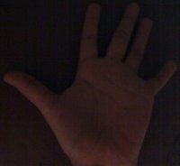

# 直方图对比(Histogram Comparison)
## 学习目标
- 学会使用[cv::compareHist](https://docs.opencv.org/4.1.2/d6/dc7/group__imgproc__hist.html#gaf4190090efa5c47cb367cf97a9a519bd)计算两个直方图的匹配度
- 学会使用不同的指标进行直方图对比

## 理论基础
- 要对比两个直方图$H_1$和$H_2$，必须先选出来一个指标$d(H_1, H_2)$来描述两个直方图的匹配度
- OpenCV使用[cv::compareHist](https://docs.opencv.org/4.1.2/d6/dc7/group__imgproc__hist.html#gaf4190090efa5c47cb367cf97a9a519bd)进行直方图对比, 该方法还提供了4个不同的指标来描述直方图的匹配度。
    1. **Correlation (CV_COMP_CORREL)**
        $$
        d(H_1, H_2) = \frac{ 
                            \sum_{I}{(H_{1}(I) - \bar{H_1})(H_{2}(I) - \bar{H_2})}
                            } 
                            {\sqrt{ \sum_{I}(H_{1}(I) - \bar{H_1})^2 \sum_{I}(H_{2}(I) - \bar{H_2})^2}}
        $$
        其中: 
        $$
            \bar{H_k}=\frac{1}{N} \sum_{J}{H_k(J)}
        
        $$
        N为直方图中bin的数量
    2. **Chi-Square (CV_COMP_CHISQR)**
        $$
            d(H_1, H_2)=\sum_{I}{
                                \frac{(H_1(I)-H_2(I))^2} {H_1(I)}}
        $$
    3. **Intersection (method=CV_COMP_INTERSECT)**
        $$
            d(H_1, H_2)= \sum_{I}{\min(H_1(I), H_2(I))}
        $$
    4. **Bhattacharyya distance (CV_COMP_BHATTACHARYYA)**
        $$
            d(H_1, H_2)= \frac{1}{
                                    1-\frac{1}{
                                                \sqrt{\bar{H_1}\bar{H_2}N^2}
                                              }\sum_{I}{
                                                  \sqrt{H_1(I)\cdot H_2(I)}
                                              }
                                 }
        $$
## 代码演示
- 代码概览
    - 加载一张基本图片和两张测试图片
    - 使用基本图片的下半部分生成一张图片
    - 将图片转换成HSV颜色模式
    - 计算图片的H-S通道的直方图，并将直方图归一化以方便对比
    - 基本的图像和两张测试图像的直方图进行对比，半张图像的直方图和基本图像的直方图进行对比
    - 显示对比的匹配参数


### 代码  

#### C++
- 代码[下载](https://github.com/opencv/opencv/tree/master/samples/cpp/tutorial_code/Histograms_Matching/compareHist_Demo.cpp)

```c++
#include "opencv2/imgcodecs.hpp"
#include "opencv2/highgui.hpp"
#include "opencv2/imgproc.hpp"
#include <iostream>
using namespace std;
using namespace cv;
const char* keys =
    "{ help  h| | Print help message. }"
    "{ input1 | | Path to input image 1. }"
    "{ input2 | | Path to input image 2. }"
    "{ input3 | | Path to input image 3. }";
int main( int argc, char** argv )
{
    CommandLineParser parser( argc, argv, keys );
    Mat src_base = imread( parser.get<String>("input1") );
    Mat src_test1 = imread( parser.get<String>("input2") );
    Mat src_test2 = imread( parser.get<String>("input3") );
    if( src_base.empty() || src_test1.empty() || src_test2.empty() )
    {
        cout << "Could not open or find the images!\n" << endl;
        parser.printMessage();
        return -1;
    }
    Mat hsv_base, hsv_test1, hsv_test2;
    cvtColor( src_base, hsv_base, COLOR_BGR2HSV );
    cvtColor( src_test1, hsv_test1, COLOR_BGR2HSV );
    cvtColor( src_test2, hsv_test2, COLOR_BGR2HSV );
    Mat hsv_half_down = hsv_base( Range( hsv_base.rows/2, hsv_base.rows ), Range( 0, hsv_base.cols ) );
    int h_bins = 50, s_bins = 60;
    int histSize[] = { h_bins, s_bins };
    // hue varies from 0 to 179, saturation from 0 to 255
    float h_ranges[] = { 0, 180 };
    float s_ranges[] = { 0, 256 };
    const float* ranges[] = { h_ranges, s_ranges };
    // Use the 0-th and 1-st channels
    int channels[] = { 0, 1 };
    Mat hist_base, hist_half_down, hist_test1, hist_test2;
    calcHist( &hsv_base, 1, channels, Mat(), hist_base, 2, histSize, ranges, true, false );
    normalize( hist_base, hist_base, 0, 1, NORM_MINMAX, -1, Mat() );
    calcHist( &hsv_half_down, 1, channels, Mat(), hist_half_down, 2, histSize, ranges, true, false );
    normalize( hist_half_down, hist_half_down, 0, 1, NORM_MINMAX, -1, Mat() );
    calcHist( &hsv_test1, 1, channels, Mat(), hist_test1, 2, histSize, ranges, true, false );
    normalize( hist_test1, hist_test1, 0, 1, NORM_MINMAX, -1, Mat() );
    calcHist( &hsv_test2, 1, channels, Mat(), hist_test2, 2, histSize, ranges, true, false );
    normalize( hist_test2, hist_test2, 0, 1, NORM_MINMAX, -1, Mat() );
    for( int compare_method = 0; compare_method < 4; compare_method++ )
    {
        double base_base = compareHist( hist_base, hist_base, compare_method );
        double base_half = compareHist( hist_base, hist_half_down, compare_method );
        double base_test1 = compareHist( hist_base, hist_test1, compare_method );
        double base_test2 = compareHist( hist_base, hist_test2, compare_method );
        cout << "Method " << compare_method << " Perfect, Base-Half, Base-Test(1), Base-Test(2) : "
             <<  base_base << " / " << base_half << " / " << base_test1 << " / " << base_test2 << endl;
    }
    cout << "Done \n";
    return 0;
}
```

#### Python
- 代码[下载](https://github.com/opencv/opencv/tree/master/samples/python/tutorial_code/Histograms_Matching/histogram_comparison/compareHist_Demo.py)

```py
from __future__ import print_function
from __future__ import division
import cv2 as cv
import numpy as np
import argparse
parser = argparse.ArgumentParser(description='Code for Histogram Comparison tutorial.')
parser.add_argument('--input1', help='Path to input image 1.')
parser.add_argument('--input2', help='Path to input image 2.')
parser.add_argument('--input3', help='Path to input image 3.')
args = parser.parse_args()
src_base = cv.imread(args.input1)
src_test1 = cv.imread(args.input2)
src_test2 = cv.imread(args.input3)
if src_base is None or src_test1 is None or src_test2 is None:
    print('Could not open or find the images!')
    exit(0)
hsv_base = cv.cvtColor(src_base, cv.COLOR_BGR2HSV)
hsv_test1 = cv.cvtColor(src_test1, cv.COLOR_BGR2HSV)
hsv_test2 = cv.cvtColor(src_test2, cv.COLOR_BGR2HSV)
hsv_half_down = hsv_base[hsv_base.shape[0]//2:,:]
h_bins = 50
s_bins = 60
histSize = [h_bins, s_bins]
# hue varies from 0 to 179, saturation from 0 to 255
h_ranges = [0, 180]
s_ranges = [0, 256]
ranges = h_ranges + s_ranges # concat lists
# Use the 0-th and 1-st channels
channels = [0, 1]
hist_base = cv.calcHist([hsv_base], channels, None, histSize, ranges, accumulate=False)
cv.normalize(hist_base, hist_base, alpha=0, beta=1, norm_type=cv.NORM_MINMAX)
hist_half_down = cv.calcHist([hsv_half_down], channels, None, histSize, ranges, accumulate=False)
cv.normalize(hist_half_down, hist_half_down, alpha=0, beta=1, norm_type=cv.NORM_MINMAX)
hist_test1 = cv.calcHist([hsv_test1], channels, None, histSize, ranges, accumulate=False)
cv.normalize(hist_test1, hist_test1, alpha=0, beta=1, norm_type=cv.NORM_MINMAX)
hist_test2 = cv.calcHist([hsv_test2], channels, None, histSize, ranges, accumulate=False)
cv.normalize(hist_test2, hist_test2, alpha=0, beta=1, norm_type=cv.NORM_MINMAX)
for compare_method in range(4):
    base_base = cv.compareHist(hist_base, hist_base, compare_method)
    base_half = cv.compareHist(hist_base, hist_half_down, compare_method)
    base_test1 = cv.compareHist(hist_base, hist_test1, compare_method)
    base_test2 = cv.compareHist(hist_base, hist_test2, compare_method)
    print('Method:', compare_method, 'Perfect, Base-Half, Base-Test(1), Base-Test(2) :',\
          base_base, '/', base_half, '/', base_test1, '/', base_test2)
```

#### Java
- 代码[下载](https://github.com/opencv/opencv/tree/master/samples/java/tutorial_code/Histograms_Matching/histogram_comparison/CompareHistDemo.java)

```java
import java.util.Arrays;
import java.util.List;
import org.opencv.core.Core;
import org.opencv.core.Mat;
import org.opencv.core.MatOfFloat;
import org.opencv.core.MatOfInt;
import org.opencv.core.Range;
import org.opencv.imgcodecs.Imgcodecs;
import org.opencv.imgproc.Imgproc;
class CompareHist {
    public void run(String[] args) {
        if (args.length != 3) {
            System.err.println("You must supply 3 arguments that correspond to the paths to 3 images.");
            System.exit(0);
        }
        Mat srcBase = Imgcodecs.imread(args[0]);
        Mat srcTest1 = Imgcodecs.imread(args[1]);
        Mat srcTest2 = Imgcodecs.imread(args[2]);
        if (srcBase.empty() || srcTest1.empty() || srcTest2.empty()) {
            System.err.println("Cannot read the images");
            System.exit(0);
        }
        Mat hsvBase = new Mat(), hsvTest1 = new Mat(), hsvTest2 = new Mat();
        Imgproc.cvtColor( srcBase, hsvBase, Imgproc.COLOR_BGR2HSV );
        Imgproc.cvtColor( srcTest1, hsvTest1, Imgproc.COLOR_BGR2HSV );
        Imgproc.cvtColor( srcTest2, hsvTest2, Imgproc.COLOR_BGR2HSV );
        Mat hsvHalfDown = hsvBase.submat( new Range( hsvBase.rows()/2, hsvBase.rows() - 1 ), new Range( 0, hsvBase.cols() - 1 ) );
        int hBins = 50, sBins = 60;
        int[] histSize = { hBins, sBins };
        // hue varies from 0 to 179, saturation from 0 to 255
        float[] ranges = { 0, 180, 0, 256 };
        // Use the 0-th and 1-st channels
        int[] channels = { 0, 1 };
        Mat histBase = new Mat(), histHalfDown = new Mat(), histTest1 = new Mat(), histTest2 = new Mat();
        List<Mat> hsvBaseList = Arrays.asList(hsvBase);
        Imgproc.calcHist(hsvBaseList, new MatOfInt(channels), new Mat(), histBase, new MatOfInt(histSize), new MatOfFloat(ranges), false);
        Core.normalize(histBase, histBase, 0, 1, Core.NORM_MINMAX);
        List<Mat> hsvHalfDownList = Arrays.asList(hsvHalfDown);
        Imgproc.calcHist(hsvHalfDownList, new MatOfInt(channels), new Mat(), histHalfDown, new MatOfInt(histSize), new MatOfFloat(ranges), false);
        Core.normalize(histHalfDown, histHalfDown, 0, 1, Core.NORM_MINMAX);
        List<Mat> hsvTest1List = Arrays.asList(hsvTest1);
        Imgproc.calcHist(hsvTest1List, new MatOfInt(channels), new Mat(), histTest1, new MatOfInt(histSize), new MatOfFloat(ranges), false);
        Core.normalize(histTest1, histTest1, 0, 1, Core.NORM_MINMAX);
        List<Mat> hsvTest2List = Arrays.asList(hsvTest2);
        Imgproc.calcHist(hsvTest2List, new MatOfInt(channels), new Mat(), histTest2, new MatOfInt(histSize), new MatOfFloat(ranges), false);
        Core.normalize(histTest2, histTest2, 0, 1, Core.NORM_MINMAX);
        for( int compareMethod = 0; compareMethod < 4; compareMethod++ ) {
            double baseBase = Imgproc.compareHist( histBase, histBase, compareMethod );
            double baseHalf = Imgproc.compareHist( histBase, histHalfDown, compareMethod );
            double baseTest1 = Imgproc.compareHist( histBase, histTest1, compareMethod );
            double baseTest2 = Imgproc.compareHist( histBase, histTest2, compareMethod );
            System.out.println("Method " + compareMethod + " Perfect, Base-Half, Base-Test(1), Base-Test(2) : " + baseBase + " / " + baseHalf
                    + " / " + baseTest1 + " / " + baseTest2);
        }
    }
}
public class CompareHistDemo {
    public static void main(String[] args) {
        // Load the native OpenCV library
        System.loadLibrary(Core.NATIVE_LIBRARY_NAME);
        new CompareHist().run(args);
    }
}
```
### 演示结果
1. 加入输出图像为:  
<div align="center">
    
    <p><strong>Base_0</strong></p>
</div>
<div align="center">
    
    <p><strong>Test_1</strong></p>
</div>
<div align="center">
    
    <p><strong>Test_2</strong></p>
</div>  

2. 对比结果分析，对于Base-Base的对比，其匹配度应该是非常高的，其实就是一张图片进行对比；对于Half-Base，其匹配度也应该不低；而Base-Test1和Base-Test2由于光照情况的原因，应该匹配度蛮低的。

3. 代码对比结果（官方文档使用的OpenCV 3.4.1，不同的版本可能存在以下细小差异）

对比方法 | Base-Base | Base-Half | Base-Test1 | Base-Test2
:------: | :------: | :------: | :------: | :------:
**Correlation** | 1.000000 | 0.880438 | 0.20457 | 0.0664547
**Chi-square** | 0.000000 | 4.6834 | 2697.98 | 4763.8
**Intersection** | 18.8947 | 13.022 | 5.44085 | 2.58173
**Bhattacharyya** | 0.000000 | 0.237887 | 0.679826 | 0.874173
>对于**Correlation**和**Intersection**值越大匹配度越高；对于**Chi-square**和**Bhattacharyya**方法值越小匹配度越高