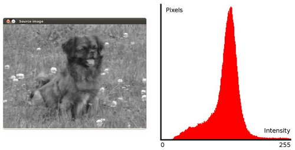
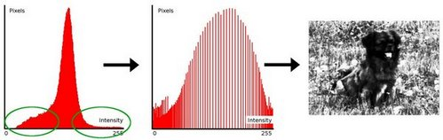
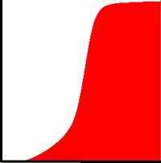
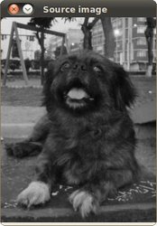
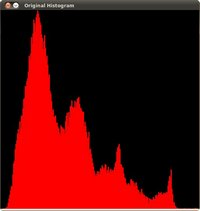
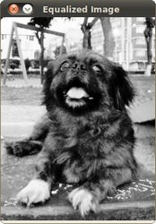
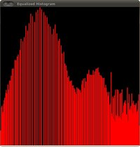

# 直方图均衡化(Histogram Equalization)
## 学习目标
- 什么是直方图(histogram)?
- 为什么直方图很有用？
- 如何使用[cv::equalizeHist](https://docs.opencv.org/4.1.2/d6/dc7/group__imgproc__hist.html#ga7e54091f0c937d49bf84152a16f76d6e)进行直方图均衡化操作

## 理论知识
### 什么是直方图
- 直方图是图像中像素值的分布情况的图像表示
- 直方图将所考虑的每个强度值量化为像素个数
<div align="center">

</div>  

## 什么事直方图均衡化
- 直方图均衡化是利用图像的直方图对图像的对比度进行调整的方法([维基百科](https://zh.wikipedia.org/wiki/%E7%9B%B4%E6%96%B9%E5%9B%BE%E5%9D%87%E8%A1%A1%E5%8C%96))。
- 上图的直方图可以看出图像的像素强度集中于与中间，而直方图均衡化就是将上图中的这个区域变大。下图中，绿色圆圈内的像素的强度较小，进行直方图均衡化处理之后的直方图如中间的图像所示，直方图均衡化处理之后的图像如右侧的图像所示。
<div align="center">

</div>  

## 背后原理
- 直方图均衡化是将直方图的分布情况变成一个更加均匀的分布，这样像素的强度值就可以分布在整个方位了，而不至于过于集中在一起。
- 直方图均衡化是通过累积分布函数(*cumulative distribution function*， 简称CDF)完成直方图的重映射的。对于直方图$H(i)$，经过累积分布函数重映射之后的直方图$H'(i)$可以表示为:  
$$
    H'(i) = \sum_{0<j<i}H(j)
$$
使用上面的累计函数，必须将$H'(i)$进行归一化处理，使得最大值为255（或者是图像中的最大值）。对于上面的实例，累积函数是：  
<div align="center">

</div>  

- 最好，可以始终在图像和均衡后的直方图上使用简单的重映射，对图像进行均衡化处理：  
$$
    equalized(x,y)=H'(src(x,y))
$$

## 演示代码
- 代码概要
    - 加载图像
    - 将图像转化为灰度图像
    - 使用`cv::equalizeHist`均衡直方图
    - 显示结果
- C++代码
```c++

#include "opencv2/imgcodecs.hpp"
#include "opencv2/highgui.hpp"
#include "opencv2/imgproc.hpp"
#include <iostream>
using namespace cv;
using namespace std;
int main( int argc, char** argv )
{
    CommandLineParser parser( argc, argv, "{@input | lena.jpg | input image}" );
    Mat src = imread( samples::findFile( parser.get<String>( "@input" ) ), IMREAD_COLOR );
    if( src.empty() )
    {
        cout << "Could not open or find the image!\n" << endl;
        cout << "Usage: " << argv[0] << " <Input image>" << endl;
        return -1;
    }
    cvtColor( src, src, COLOR_BGR2GRAY );
    Mat dst;
    equalizeHist( src, dst );
    imshow( "Source image", src );
    imshow( "Equalized Image", dst );
    waitKey();
    return 0;
}
```
- Python
```python
from __future__ import print_function
import cv2 as cv
import argparse
parser = argparse.ArgumentParser(description='Code for Histogram Equalization tutorial.')
parser.add_argument('--input', help='Path to input image.', default='lena.jpg')
args = parser.parse_args()
src = cv.imread(cv.samples.findFile(args.input))
if src is None:
    print('Could not open or find the image:', args.input)
    exit(0)
src = cv.cvtColor(src, cv.COLOR_BGR2GRAY)
dst = cv.equalizeHist(src)
cv.imshow('Source image', src)
cv.imshow('Equalized Image', dst)
cv.waitKey()
```
### 代码运行结果
1. 原始图像，图像的对比度不强:
<div align="center">
    
</div>

2. 原始图像的直方图:
<div align="center">
    
</div>

3. 应用直方图均衡后的图像：
<div align="center">
    
</div>

4. 最终图像的直方图：
<div align="center">
    
</div>


