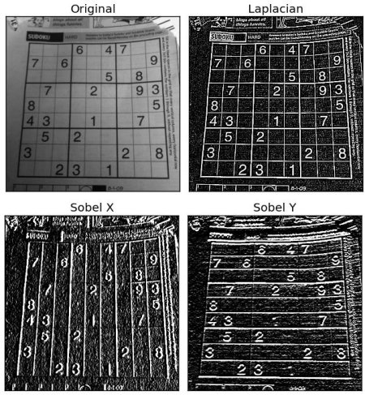
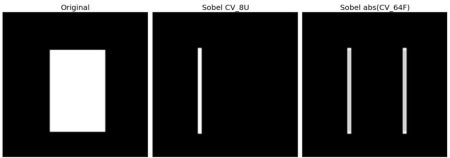

# 图像梯度(Image Gradients)
OpenCV提供三种图像的梯度计算(高通滤波 High-pass filters)：Sobel、Scharr和Laplacian。
## Sobel和Scharr求导
Sobel算子是一种图像模糊(Smoothing)和图像微分(Differentiation)的操作，因此噪声对Sobel的影响要小一点。使用Sobel算子可以通过分别指定yorder和xorder的参数来分别计算图像在x方向和y方向的导数。而且可以通过ksize参数指定kernel的尺寸。如果ksize=-1, 则OpenCV使用3x3尺寸的Scharr滤波，这比使用3x3尺寸的Sobel滤波要精确的多。
## Laplacian求导
Laplacian算子的数学表达为$$\Delta{src}=\frac{\delta^2{src}}{\delta{x^2}}+\frac{\delta^2{src}}{\delta{y^2}}$$,如果ksize=1，则laplacian算子的核可以表示为:  
$$
    Kernel = \begin{bmatrix}
            0 & 1 & 0 \\
            1 & -4 & 1 \\
            0 & 1 & 0
            \end{bmatrix}
$$

## 示例代码
```py
import numpy as np
import cv2 as cv
from matplotlib import pyplot as plt
img = cv.imread('dave.jpg',0)
laplacian = cv.Laplacian(img,cv.CV_64F)
sobelx = cv.Sobel(img,cv.CV_64F,1,0,ksize=5)
sobely = cv.Sobel(img,cv.CV_64F,0,1,ksize=5)
plt.subplot(2,2,1),plt.imshow(img,cmap = 'gray')
plt.title('Original'), plt.xticks([]), plt.yticks([])
plt.subplot(2,2,2),plt.imshow(laplacian,cmap = 'gray')
plt.title('Laplacian'), plt.xticks([]), plt.yticks([])
plt.subplot(2,2,3),plt.imshow(sobelx,cmap = 'gray')
plt.title('Sobel X'), plt.xticks([]), plt.yticks([])
plt.subplot(2,2,4),plt.imshow(sobely,cmap = 'gray')
plt.title('Sobel Y'), plt.xticks([]), plt.yticks([])
plt.show()
```  

<div style="text-align: center">
    
    <h6>images</h6>
</div>

## 需要注意的事情
在上面的例子中，输出图像的深度是的`CV_8U`(np.uint8)。但这里有一个小bug， 从黑色到白色变化的区域的梯度是正值，而从白色到黑色过渡的区域的斜率是负值，因此当把数据转换为np.unit8的时候，所有的负值将会变成0，这样就会丢失一些数据。   

如果是检测边界，最好是的将输出数据的深度设置的高一点，比如`CV_16S`，`CV_64F`等, 在转换为`CV_8U`之前下取输出图像的绝对值。
### 演示代码
```python
import numpy as np
import cv2 as cv
from matplotlib import pyplot as plt
img = cv.imread('box.png',0)
# Output dtype = cv.CV_8U
sobelx8u = cv.Sobel(img,cv.CV_8U,1,0,ksize=5)
# Output dtype = cv.CV_64F. Then take its absolute and convert to cv.CV_8U
sobelx64f = cv.Sobel(img,cv.CV_64F,1,0,ksize=5)
abs_sobel64f = np.absolute(sobelx64f)
sobel_8u = np.uint8(abs_sobel64f)
plt.subplot(1,3,1),plt.imshow(img,cmap = 'gray')
plt.title('Original'), plt.xticks([]), plt.yticks([])
plt.subplot(1,3,2),plt.imshow(sobelx8u,cmap = 'gray')
plt.title('Sobel CV_8U'), plt.xticks([]), plt.yticks([])
plt.subplot(1,3,3),plt.imshow(sobel_8u,cmap = 'gray')
plt.title('Sobel abs(CV_64F)'), plt.xticks([]), plt.yticks([])
plt.show()
```

<div style="text-align: center">
    
    <h6>image</h6>
</div>  


