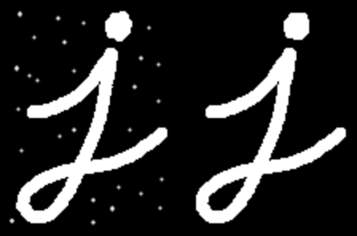
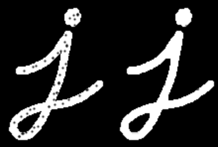
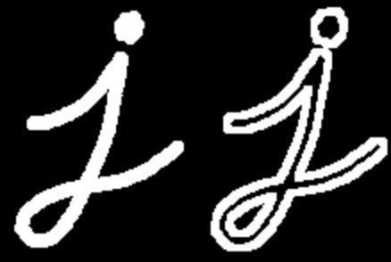
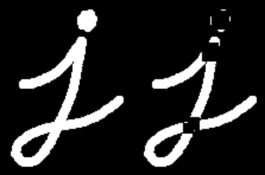
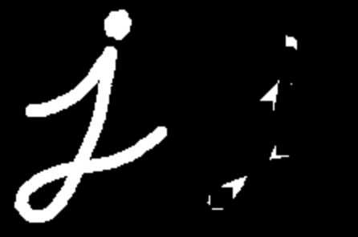

# 其他的图像形态学运算(More Morphology Transformations)
官方文档地址:https://docs.opencv.org/4.1.2/d3/dbe/tutorial_opening_closing_hats.html
该文档不要讲述使用`cv::morphologyEx`进行一些除了erode和dilate之外的其他形态学运算：
- Opening:开运算
- Closing:闭运算
- Morphological Gradient:形态学梯度
- Top Hat:礼帽计算
- Black Hat:黑帽计算

无论形态学计算描述的多么复杂，其都是在Erosion和Dilation进行组合的运算。

## Opening 开运算
- 开运算本质上是对图像先进行ersion，然后执行dilation，所以开运算特别适合用于去除图像中的白色噪声点。  
    $$
        dst = open(src, kernel) = dilate(erode(src, kernel)) 
    $$
- 如下图所示，左侧的是原图，右侧的是执行开运算之后的图像。  

## Closing 闭运算
- 与开运算相反，对图像先进行dilation，在进行erosion，所以闭运算适合去除图像中的黑色噪声点。
    $$
        dst = close(src, kernel) = erode(dilate(src, kernel))
    $$
- 如下图所示，左侧的是原图，右侧的是执行闭运算之后的图像。  

## Morphological Gradient 形态学梯度
- dilation与erosion的差表示为形体学梯度
    $$
        dst = morph_{gard}(src, kernel) = dilate(src, kernel) - erode(src, kernel)
    $$
- 形态学梯度在获取对象的外轮廓线的时候非常有用。  

## Top Hat 礼帽运算
- 礼帽运算用于发现原始图像与开运算之后的图像的差。  
    $$
        dst = tophat(src, kernel) = src - open(src, kernel)
    $$

## Black Hat 黑帽运算
- 黑帽运算是图像闭运算与原始图像的差。  
    $$
        dst = blackhat(src, kernel) = close(src, kernel) - src
    $$
    

