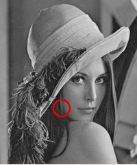
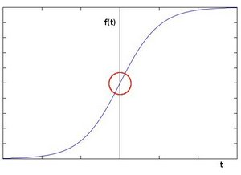
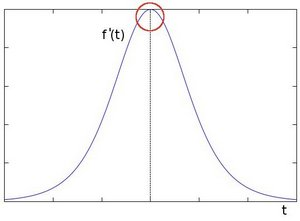

# Sobel导数(Sebel Derivatives)
- 使用`Sobel()`计算图像导数
- 使用`Scharr()`和3x3的核计算图像更加精确的导数

## 理论
1. 卷积最重要的作用之一是计算图像的导数。
2. 为什么计算图像的导数是非常重要的呢？

    <div style="text-align: center">
        
    </div>  

    上图中可以很容易的看到图像的边界，用于⭕️内的图像像素发生了剧烈变化。而这种变化的趋势使用导数很容易表达，梯度上的剧烈变化指示着图像中的显著变化。  

3. 设想一个一维图像，图像中像素强度发生跳跃变化的地方可以表示为边界

    <div style="text-align: center">
        
    </div>  

4. 如果对上面的图像求一阶导数，很容易分辨出跳跃出来的边界  

    <div style="text-align: center">
        
    </div>  

5. 由此可以推断检测图像中的边缘区域可以通过判断像素的梯度是否比邻域高来判断。

## Sobel 算子
1. Sobel算子是离散微分算子，与计算图像像素值的梯度的运算相当；
2. Sobel算子结合了高斯模糊和微分运算；

### 公式
假设图像$$I$$:  
1. 有两个方向的导数：  
    1. 水平方向的导数：水平方向的图像导数$$G_x$$使用奇数尺寸的核与图像$$I$$进行卷积，例如使用一个3x3的核与图像进行卷积:  
        $$
            G_x = \begin{bmatrix}
                    -1 & 0 & +1 \\
                    -2 & 0 & +2 \\
                    -1 & 0 & +1
                  \end{bmatrix} \cdot I
        $$
    2. 竖直方向的导数：竖直方向的图像导数$$G_y$$使用奇数尺寸的核与图像$$I$$进行卷积，例如使用一个3x3的核与图像进行卷积:  
        $$
            G_y = \begin{bmatrix}
                    -1 & -2 & -1 \\
                    0 & 0 & 0 \\
                    +1 & +2 & +1
                  \end{bmatrix} \cdot I
        $$
2. 图像上任意一点的导数大小可以通过对Sobel算子的x方向和y方向的导数的算术平方根近似求出：  
    $$
        G = \sqrt{G_x^2+G_y^2}
    $$
    该值有时候也被简化为：
    $$
        G = |G_x|+|G_y|
    $$

**说明：**    

当核的的size是3的时候，OpenCV实际上使用的核可能与上面所示的核有所差异（毕竟，`Sobel()`仅仅是图像导数的近似操作）。OpenCV使用`Scharr()`来解决尺寸为3的核的不精确的问题。这种`Scharr()`运算和`Sobel()`的速度是一样快的，但是其更加精确，其使用的核如下厕所示：

$$
        Kernel_x= \begin{bmatrix}
                    -3 & 0 & +3 \\
                    -10 & 0 & +10 \\
                    -3 & 0 & +3
                  \end{bmatrix} 
$$
$$
        Kernel_y= \begin{bmatrix}
                    -3 & -10 & -3 \\
                    0 & 0 & 0 \\
                    +3 & +10 & +3
                  \end{bmatrix} 
$$

[Scharr()](https://docs.opencv.org/4.1.2/d4/d86/group__imgproc__filter.html#gaa13106761eedf14798f37aa2d60404c9)和[Sobel()](https://docs.opencv.org/4.1.2/d4/d86/group__imgproc__filter.html#gacea54f142e81b6758cb6f375ce782c8d)具体说明详见官方文档。

## 实例代码
```c++
#include "opencv2/imgproc.hpp"
#include "opencv2/imgcodecs.hpp"
#include "opencv2/highgui.hpp"
#include <iostream>
using namespace cv;
using namespace std;
int main( int argc, char** argv )
{
  cv::CommandLineParser parser(argc, argv,
                               "{@input   |lena.jpg|input image}"
                               "{ksize   k|1|ksize (hit 'K' to increase its value at run time)}"
                               "{scale   s|1|scale (hit 'S' to increase its value at run time)}"
                               "{delta   d|0|delta (hit 'D' to increase its value at run time)}"
                               "{help    h|false|show help message}");
  cout << "The sample uses Sobel or Scharr OpenCV functions for edge detection\n\n";
  parser.printMessage();
  cout << "\nPress 'ESC' to exit program.\nPress 'R' to reset values ( ksize will be -1 equal to Scharr function )";
  // First we declare the variables we are going to use
  Mat image,src, src_gray;
  Mat grad;
  const String window_name = "Sobel Demo - Simple Edge Detector";
  int ksize = parser.get<int>("ksize");
  int scale = parser.get<int>("scale");
  int delta = parser.get<int>("delta");
  int ddepth = CV_16S;
  String imageName = parser.get<String>("@input");
  // As usual we load our source image (src)
  image = imread( samples::findFile( imageName ), IMREAD_COLOR ); // Load an image
  // Check if image is loaded fine
  if( image.empty() )
  {
    printf("Error opening image: %s\n", imageName.c_str());
    return EXIT_FAILURE;
  }
  for (;;)
  {
    // Remove noise by blurring with a Gaussian filter ( kernel size = 3 )
    GaussianBlur(image, src, Size(3, 3), 0, 0, BORDER_DEFAULT);
    // Convert the image to grayscale
    cvtColor(src, src_gray, COLOR_BGR2GRAY);
    Mat grad_x, grad_y;
    Mat abs_grad_x, abs_grad_y;
    Sobel(src_gray, grad_x, ddepth, 1, 0, ksize, scale, delta, BORDER_DEFAULT);
    Sobel(src_gray, grad_y, ddepth, 0, 1, ksize, scale, delta, BORDER_DEFAULT);
    // converting back to CV_8U
    convertScaleAbs(grad_x, abs_grad_x);
    convertScaleAbs(grad_y, abs_grad_y);
    addWeighted(abs_grad_x, 0.5, abs_grad_y, 0.5, 0, grad);
    imshow(window_name, grad);
    char key = (char)waitKey(0);
    if(key == 27)
    {
      return EXIT_SUCCESS;
    }
    if (key == 'k' || key == 'K')
    {
      ksize = ksize < 30 ? ksize+2 : -1;
    }
    if (key == 's' || key == 'S')
    {
      scale++;
    }
    if (key == 'd' || key == 'D')
    {
      delta++;
    }
    if (key == 'r' || key == 'R')
    {
      scale =  1;
      ksize = -1;
      delta =  0;
    }
  }
  return EXIT_SUCCESS;
}
```


