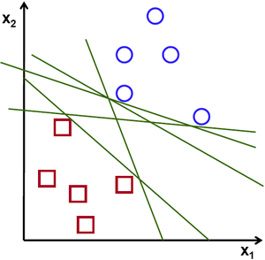
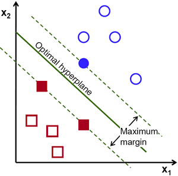
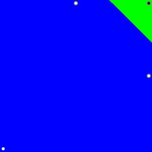

# 支持向量机(SVM)
[原文](https://docs.opencv.org/4.1.2/d1/d73/tutorial_introduction_to_svm.html)
## 何为SVM?
SVM, Support Vector Machines,支持向量机，是一种分类算法，是通过分离超平面定义的一种判别式分类器。换句话说，通过对给定带标签的训练数据监督学习，该算法将输出用于新示例数据分类的最优超平面。  

SVM的最基本形式是基于系列样本对两类进行区分。SVM的扩展算法可以用于实现多类($$N_c > 2$$)分类。SVM的精髓在于核函数的使用，即将某个特定维度空间的数据映射到高维空间去，这个空间被称为和空间。在这个空间中，线性分类器常常可以找到两类的分界函数，及时在原始的低维空间不存在这样的分界函数。SVM也被称之为"最大类间距分类器"，因为它选择的在核空间的超平面不仅可以区分两个类别，还能保证对于两类样本中所有样本点到超平面的空间距离之和最大。最接近超平面的那些样本，决定了超平面所处的位置，这些样本称之为"支持向量"。支持向量的意义在于一旦确定，就将他们保留下来预测将来得到的数据点的类别即可。  

那么从什么意义上来说才是超平面最优？我们来思考下面的这个问题：  
对于属于两个类别之一的线性可分离2D点集，尝试找到一条分离直线。  

<div style="text-align: center">
    
    <h6>用于分离两类点的直线</h6>
</div>  

**注意:**
> 在此示例中，我们处理笛卡尔平面中的线和点，而不是高维空间中的超平面和向量. 这是一个简化的问题。重要的是要理解之所以这样简化，是因为我们直觉上更容易在脑海里想象这个例子。以此类推，我们可以把同样的改建应用到高于二维空间的分类问题中。

在上图中可以看到可以绘制多条直线来解决这个问题，但是那一条才是最好的呢？我们可以直观地定义一个标准来估算线的这些直线的价值：一条距离点太近的直线是比较糟糕的，因为太容易受到噪声的干扰了，容易产生不正确的分类。因此我们需要找到一条距离所有都尽可能远的直线。

因此，SVM算子的是基于找到与训练数据之间最大最新距离的超平面的理论。此距离两倍在SVM理论中是一个名为**margin**的重要概念。因此，最佳分离超平面可最大化训练数据的**margin**。

<div style="text-align: center">
    
    <h6>超平面示意</h6>
</div>  

## 如何计算最优超平面？
定义超平面的方程为：  
$$
    f(x) = {\beta}_0 + {\beta}^T x
$$

其中$$\beta$$可以为权重向量，而$${\beta}_0$$为偏差(截距)

通过缩放$$\beta$$和$${\beta}_0$$可以得到无数种表示最优超平面的组合。按照惯例，在超平面的所有可能表示形式中，选择的是:  
$$
    | {\beta}_0 + {\beta}^T x | = 1
$$

其中$$x$$表示最靠近超平面的训练集。通常来说，靠近超平面的用于训练的样本称之为**支持向量(support vector)**。这种表示称之为**规范超平面（canonical hyperplane）**。  

现在，使用几何学来来表示点$$x$$与超平面$$({\beta}, {\beta}_0)$$的之间的距离:  
$$
    distance = \frac{|{\beta}_0 + {\beta}^T x |}{||{\beta}||}
$$

对于规范超平面这一特例，分子等于1，则到支持向量的距离为：  
$$
    {distance}_{support vectors} = \frac{|{\beta}_0 + {\beta}^T x |}{||{\beta}||} = \frac{1}{||{\beta}||}
$$

结合前面所述的**margin**，记为$$M$$, $$M$$是支持向量到规范超平面的两倍：  
$$
    M = \frac{2}{||{\beta}||}
$$

最终最大化$$M$$的问题转化为了最小化$$L(\beta)$$的问题:  
$$
\min_{\beta, \beta_{0}} L(\beta) = \frac{1}{2}||\beta||^{2} \text{ subject to } y_{i}(\beta^{T} x_{i} + \beta_{0}) \geq 1 \text{ } \forall i,
$$

其中$$y_i$$表示训练数据的标签

这样最终把最优超平面的问题转为了拉格朗日优化问题，可以使用拉格朗日乘法器解决该问题，以获取最佳的超平面的权重向量$$\beta$$和偏差$${\beta}_0$$。

## 演示代码
[import](../../src/ProjectsCpp/MachineLearning/SVM/ML_tutorial_introduction_svm.cpp)

## 代码说明
### 1. 设置训练数据
代码中训练数据为属于两个不同分类的打上标签的2D点集，这两个分类中，一个分类有一个点，另外一个分类有三个点；

```c++
    int labels[4] = {1, -1, -1, -1};
    float trainingData[4][2] = { {501, 10}, {255, 10}, {501, 255}, {10, 501} };
```

[`cv::ml::SVM::train()`](https://docs.opencv.org/4.1.2/db/d7d/classcv_1_1ml_1_1StatModel.html#af96a0e04f1677a835cc25263c7db3c0c)的输入位浮点型的`cv::Mat`，因此需要将训练数据和标签数据装配到`cv::Mat`类型的变量中:  

```c++
    Mat trainingDataMat(4, 2, CV_32F, trainingData);
    Mat labelsMat(4, 1, CV_32SC1, labels);
```

### 2. 配置SVM参数
在本教程中，我们将在最简单的情况下介绍SVM的理论，将训练示例分为线性可分离的两类。不过，SVM可以用于各种各样的问题（例如，非线性可分离数据的问题，使用内核函数提高示例维数的SVM等）。因此，我们必须在训练SVM之前定义一些参数，这些参数存储在类[`cv::ml::SVM`](https://docs.opencv.org/4.1.2/d1/d2d/classcv_1_1ml_1_1SVM.html)的对象中。  

```c++
  //训练SVM
  Ptr<SVM> svm = SVM::create();
  svm->setType(SVM::C_SVC);
  svm->setKernel(SVM::LINEAR);
  svm->setTermCriteria(TermCriteria(TermCriteria::MAX_ITER, 100, 1e-6));
```

其中：  
- SVM type:我们在这里选择可用于n级分类的类型[`C_SVC`](https://docs.opencv.org/4.1.2/d1/d2d/classcv_1_1ml_1_1SVM.html#ab4b93a4c42bbe213ffd9fb3832c6c44fa18157ccaec6a252b901cff6de285d608)（n≥2）.这种类型的重要特征是它可以处理不完美的类分离（即，当训练数据是非线性可分离的时）。此功能在这里并不重要，因为数据是线性可分离的，我们选择此SVM类型仅是因为它是最常用的；
- SVM kernel类型:这里没有谈论内核功能，因为它们对于演示示例正在处理的训练数据不感兴趣。不过，现在先简要地解释内核函数背后的主要思想。SVM核是对训练数据的映射，以提高其与线性可分离数据集的相似度。该映射包括增加数据的维数，并使用内核函数有效地完成了映射。我们在这里选择LINEAR类型，这意味着不执行任何映射。使用[`cv::ml::SVM::setKernel`](https://docs.opencv.org/4.1.2/d1/d2d/classcv_1_1ml_1_1SVM.html#ad6f4f45983d06817b9782978ca0f6f6f)定义此参数;
- Termination criteria of the algorithm(算法的终止条件):SVM训练过程以迭代方式解决约束二次优化问题,在这里，我们指定了最大的迭代次数和公差误差，因此即使尚未计算出最佳超平面，也允许算法以较少的步骤完成.此参数在结构[`cv::TermCriteria`](https://docs.opencv.org/4.1.2/d9/d5d/classcv_1_1TermCriteria.html)中定义

### 3. 执行准连
调用方法[`cv::ml::SVM::train`](https://docs.opencv.org/4.1.2/db/d7d/classcv_1_1ml_1_1StatModel.html#af96a0e04f1677a835cc25263c7db3c0c)来构建SVM模型.  

```c++
svm->train(trainingDataMat, ROW_SAMPLE, labelsMat);
```

### 4. 使用SVM对区域进行分类
方法[`cv::ml::SVM::predict`](https://docs.opencv.org/4.1.2/db/d7d/classcv_1_1ml_1_1StatModel.html#a1a7e49e1febd10392452727498771bc1)用于使用训练的SVM模型对输入样本进行分类。在此示例中，我们使用了此方法，根据SVM所做的预测为空间着色，换句话说，遍历图像时将其像素解释为笛卡尔平面的点。每个点都根据SVM预测的类别进行着色。如果是带有标签1的类，则为绿色；如果是带有标签-1的类，则为蓝色。  

```c++
  // 显示SVM给出的确定区域
  Vec3b green(0, 255, 0), blue(255, 0, 0);
  for (int i = 0; i < image.rows; i++)
  {
    for (int j = 0; j < image.cols; j++)
    {
      Mat sampleMat = (Mat_<float>(1,2) << j,i);
      float response = svm->predict(sampleMat);
      if (response == 1)
        image.at<Vec3b>(i,j)  = green;
      else if (response == -1)
        image.at<Vec3b>(i,j)  = blue;
    }
  }
```

### 5. 支持向量
在这里，我们使用两种方法来获取有关支持向量的信息.   
1. 我们提前已知训练数据
2. 方法[`cv::ml::SVM::getSupportVectors`](https://docs.opencv.org/4.1.2/d1/d2d/classcv_1_1ml_1_1SVM.html#a2c3fb4b3c80b8fce0b8654f103339300)可以获取索引的支持向量。我们在这里使用了这种方法来查找作为支持向量的训练示例并突出显示它们。 

```c++
  // 显示训练数据
  int thickness = -1;
  circle( image, Point(501,  10), 5, Scalar(  0,   0,   0), thickness );
  circle( image, Point(255,  10), 5, Scalar(255, 255, 255), thickness );
  circle( image, Point(501, 255), 5, Scalar(255, 255, 255), thickness );
  circle( image, Point( 10, 501), 5, Scalar(255, 255, 255), thickness );

  // 显示支持向量
  thickness = 2;
  Mat sv = svm->getUncompressedSupportVectors();
  for (int i = 0; i < sv.rows; i++)
  {
    const float* v = sv.ptr<float>(i);
    circle(image,  Point( (int) v[0], (int) v[1]), 6, Scalar(128, 128, 128), thickness);
  }
```

### 代码运行结果

<div style="text-align: center">
    
    <h6>Result</h6>
</div>  


