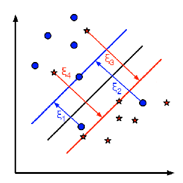
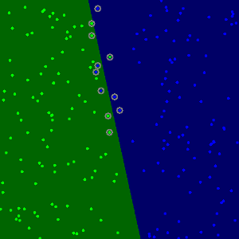

# 支持向量机用于非线性可分离数据
[原文](https://docs.opencv.org/4.1.2/d0/dcc/tutorial_non_linear_svms.html)
## 学习目标
- 在无法线性分离训练数据时，为SVM定义优化问题
- 如何配置参数以使SVM适应此类问题

## 动机
扩展SVM优化问题以处理非线性可分离的训练数据为何有趣？与简单的线性分类器相比，在计算机视觉中使用SVM的大多数应用程序需要功能更强大的工具。这源于以下事实：在这些任务中，训练数据很少可以使用超平面分离。

请考虑以下任务之一，例如，人脸检测。在这种情况下，训练数据由一组作为面部的图像和另一组非面部的图像（世界上除面部以外的所有其他事物）组成。该训练数据太复杂，以至于无法找到每个样本（特征向量）的表示形式，从而使整个人脸与整个非人脸线性分离。

## 优化问题的扩展

请记住，使用SVM，我们可以获得单独的超平面。因此，由于训练数据现在是非线性可分离的，因此我们必须承认，发现的超平面会误分类某些样本。这种错误分类是必须考虑优化一个新的变量。新模型必须既包括寻找具有最大余量的超平面的旧要求，又包括通过不允许太多分类错误来正确地概括训练数据的新方法。

我们从优化问题的表述开始，即找到使**marign**最大化的超平面（在上一教程（[支持向量机简介](../SVM/svm.md)）中对此进行了解释：   
$$
\min_{\beta, \beta_{0}} L(\beta) = \frac{1}{2}||\beta||^{2} \text{ subject to } y_{i}(\beta^{T} x_{i} + \beta_{0}) \geq 1 \text{ } \forall i
$$

可以通过多种方式修改此模型，以便考虑错误分类错误。例如，可以考虑将训练数据中的相同数量加上错误分类错误次数的常数乘以最小，即:  
$$
\min ||\beta||^{2} + C \text{(\# misclassication errors)}
$$

但是，这不是一个很好的解决方案，因为除其他原因外，我们不区分与正确决策区域相距一小段距离而被错误分类的样本或未归类的样本。因此，更好的解决方案将考虑错误分类的样本到其正确决策区域的距离，即:  
$$
\min ||\beta||^{2} + C \text{(distance of misclassified samples to their correct regions)}
$$

如此训练数据这的每一个每个样本新增了一个新的参数$${\xi}_i$$. 这些参数中的每一个都包含从其相应的训练样本到其正确决策区域的距离。下图显示了来自两类的非线性可分离训练数据，一个分离的超平面和到错误分类的样本的正确区域的距离。  

    

  

**注意:**
> 图片中仅显示分类错误的样本的距离。其余样本的距离为零，因为它们已经位于正确的决策区域中。

图片上出现的红线和蓝线是每个决策区域的边距, 每个$${\xi}_i$$表示从错误分类的训练样本到其适当区域的边缘。最后，针对优化问题的新公式为：  

$$
\min_{\beta, \beta_{0}} L(\beta) = ||\beta||^{2} + C \sum_{i} {\xi_{i}} \text{ subject to } y_{i}(\beta^{T} x_{i} + \beta_{0}) \geq 1 - \xi_{i} \text{ and } \xi_{i} \geq 0 \text{ } \forall i
$$

那么如何选择参数C？显然，这个问题的答案取决于训练数据的分布方式。尽管没有一般性的答案，但考虑以下规则会很有用：  
- C的值越大，解决方案的分类错误越少，但margin也越小。考虑到在这种情况下，进行错误分类错误是昂贵的。由于优化的目的是使参数最小化，因此几乎没有错误分类错误。
- C的值越小，解决方案的裕度就越大，分类误差也越大。在这种情况下，最小化对总和项的考虑不多，因此它更多地集中在寻找具有大余量的超平面上

## 示例代码
[import](../../src/ProjectsCpp/MachineLearning/SVM_for_Non-Linearly_Sperable_Data/ML_non_linear_svms.cpp)

    
    <h6>Result</h6>

  

