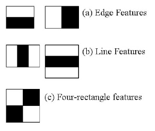
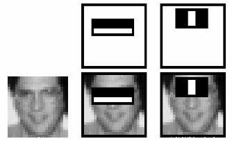

# 级联分类器(Cascade Classifier)
## 学习目标
- 基于HAAR Cascade对象检测的工作原理
- 使用基本的Haar Cascade检测面部和眼部
- 使用[`cv::CascadeClassifier`](https://docs.opencv.org/4.1.2/d1/de5/classcv_1_1CascadeClassifier.html)进行视频流实时检测
    - [`cv::CascadeClassifier::load`](https://docs.opencv.org/4.1.2/d1/de5/classcv_1_1CascadeClassifier.html#a1a5884c8cc749422f9eb77c2471958bc)加载xml格式的Haar特征或LBP特征的级联分类器
    - [`cv::CascadeClassifier::detectMultiScale`](https://docs.opencv.org/4.1.2/d1/de5/classcv_1_1CascadeClassifier.html#aaf8181cb63968136476ec4204ffca498)执行检测

## 理论
使用基于Haar特征的级联分类器进行对象检测是Paul Viola和Michael Jones在其论文[**Rapid Object Detection using a Boosted Cascade of Simple Features**](https://docs.opencv.org/4.1.2/d0/de3/citelist.html#CITEREF_Viola04)中提出的一种有效的对象检测方法。这是一种基于机器学习的方法，从许多正负图像样本中训练级联函数。然后用于检测其他图像中的对象。  

在这里，我们以人脸检测为例。最初，该算法需要大量正图像（面部图像）和负图像（无面部图像）来训练分类器。然后，我们需要从中提取特征。为此，使用下图所示的Haartevg。它们就像我们的卷积核。每个特征都是通过从黑色矩形下的像素总和中减去白色矩形下的像素总和而获得的单个值。  

<div style="text-align: center">
    
</div>  

现在，每个内核的所有可能大小和位置都用于计算许多特征，（试想一下，它需要多少计算？即使是24x24的窗口也会产生超过160000个特征)。对于每个特征计算，我们需要找到白色和黑色矩形下的像素总和。为了解决这个问题，他们引入了积分图像。无论您的图像有多大，它都会将给定像素的计算减少到仅涉及四个像素的操作。很好，不是吗？它使计算变得超快。  

然而在我们计算出的所有这些特征中，大多数的特征都是不相关的(没用的)。 例如，考虑下图。 第一行显示了两个良好的特层。 选择的第一个特征似乎着眼于眼睛的区域通常比鼻子和脸颊的区域更暗的属性。 选择的第二个功能取决于眼睛比鼻子的鼻梁更黑的属性。 但是将相同的窗口应用于脸颊或其他任何地方都没有关系。 那么，我们如何从160000+个特征中选择最佳特征？ 它是由Adaboost实现的。  

<div style="text-align: center">
    
    <h6></h6>
</div>  

为此，我们将所有特征应用于所有训练图像。对于每个特征，Adaboost会找到最佳的阈值，该阈值会将包含面部图像标记为正值，没有包含面部的图像标记为负值。显然，会有误分的情况，我们选择错误率最低的特征，这意味着它们是对人脸和非人脸图像进行最准确分类的特征。实际此过程并非如此简单。在开始时，每个图像的权重均相等。在每次分类后，错误分类的图像的权重都会增加。然后执行相同的过程。将计算新的错误率和权重。 继续进行此过程，直到达到所需的精度或错误率或找到所需的特征数量为止。 

最终分类器是这些弱分类器的加权和。之所以称为弱分类器，是因为它本身无法对图像进行分类，但是与其他弱分类器一起构成了强分类器。该论文说，甚至200个特征其检测准确度就可以达到95％。他们的最终设置具有大约6000个功能。 （想象一下，从160000多个功能减少到6000个功能。这是一个很大的进步）。

因此，现在您拍摄一张照片，使用24x24窗口和6000个功能来检测图像中是否包含用面部。哇..这不是效率低下又费时吗？是的。作者对此有一个很好的解决方案。

在图像中，大多数区域是非面部区域。因此一种简单好用的方法是检查窗口是否不是面部区域。如果不是，就立即舍弃掉该窗口，后续就不再处理了。相反，重点放在可能有脸的区域。这样，我们将花费更多时间检查可能的面部区域。

为此，他们引入了级联分类器的概念。不是将所有6000个特征应用到一个窗口中，而是将这些特征分组到不同阶段的分类器，一步一步的计算。（通常，前几个阶段将包含很少的特征）。如果窗口在第一阶段失败，则将其丢弃。我们不考虑它的其余功能。如果通过，则应用功能的第二阶段并继续该过程。经过所有阶段的窗口是一个面部区域。这个计划怎么样！

作者的检测器具有6000多个特征，具有38个阶段，在前五个阶段具有1、10、25、25和50个特征。 （上图中的两个功能实际上是从Adaboost获得的最佳两个功能）。根据作者的说法，每个子窗口平均评估了6000多个特征中的10个特征。

这里仅仅是Viola-Jones人脸检测工作原理的简单直观说明，要详细了解还得看原文。

## 关键代码说明
### 1.加载Cascade模型

```c++
CascadeClassifier face_cascade;
String face_cascade_name = samples::findFile("haarcascade_frontalface_alt.xml");
if( !face_cascade.load( face_cascade_name ) )
    {
        cout << "--(!)Error loading face cascade\n";
        return -1;
    };
```

### 2.使用Cascade进行检测

```c++
    Mat frame_gray;
    cvtColor( frame, frame_gray, COLOR_BGR2GRAY );
    equalizeHist( frame_gray, frame_gray );
    //-- Detect faces
    std::vector<Rect> faces;
    face_cascade.detectMultiScale( frame_gray, faces );
    for ( size_t i = 0; i < faces.size(); i++ )
    {
        Point center( faces[i].x + faces[i].width/2, faces[i].y + faces[i].height/2 );
        ellipse( frame, center, Size( faces[i].width/2, faces[i].height/2 ), 0, 0, 360, Scalar( 255, 0, 255 ), 4 );
    }
```

## 演示代码
[代码](https://docs.opencv.org/4.1.2/db/d28/tutorial_cascade_classifier.html)

[import](../../src/ProjectsCpp/ObjectDetection/OD_cascade_classifier.cpp)


