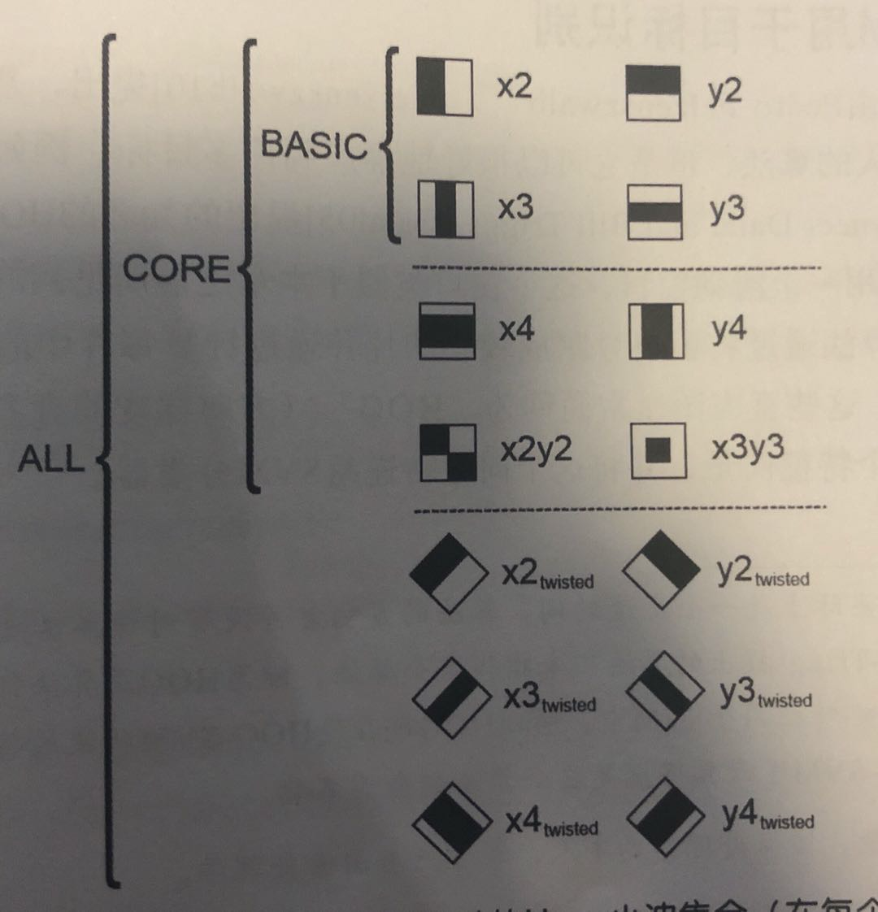

# 级联分类器的训练

**Tips:** 本节内容最好和*学习OpenCV 3(中文版)* 第22章学习新目标结合阅读

使用弱分类器的增强级联包括两个主要阶段：训练阶段和检测阶段。[上节](../CascadeClassifier/cascade_classifier.md)已经描述了如何使用基于HAAR或LBP模型的检测。本文档描述一下如何训练自己的级联检测器。训练级联检测器主要包括三个步骤：  
- 收集训练数据
- 预处理训练数据
- 进行模型训练

OpenCV官方提供的[opencv_createsamples](https://github.com/opencv/opencv/tree/master/apps/createsamples),[opencv_annotation](https://github.com/opencv/opencv/tree/master/apps/annotation), [opencv_traincascade](https://github.com/opencv/opencv/tree/master/apps/traincascade)和[opencv_visualisation](opencv_visualisation)可以作为很好的参考。  

**Tips:**
> - 如果您遇到任何涉及旧的opencv_haartraining工具（不推荐使用，仍在使用OpenCV1.x接口）的教程，请忽略该教程并坚持使用opencv_traincascade工具。此工具是较新的版本，根据OpenCV 2.x和OpenCV 3.x API用C ++编写。opencv_traincascade同时支持类似HAAR的小波特征和LBP（局部二进制模式）。特征。与HAAR特征相比，LBP特征产生整数精度，而HAAR产生浮点精度，因此LBP的训练和检测速度都比HAAR特征快几倍。关于LBP和HAAR的检测质量，主要取决于所使用的训练数据和选择的训练参数。完全可以在少于HAAR的训练时间内，训练出与基于HAAR的分类器几乎相同的质量的基于LBP的分类器。
> - OpenCV 2.x和OpenCV 3.x（[`cv::CascadeClassifier`](https://docs.opencv.org/4.1.2/d1/de5/classcv_1_1CascadeClassifier.html)中的较新的级联分类器检测接口支持使用新旧模型格式。如果由于某种原因而使用旧接口，opencv_traincascade甚至可以以旧格式保存（导出）经过训练的级联。然后至少可以在最稳定的接口中训练模型。
> - opencv_traincascade应用程序可以使用TBB进行多线程处理。要在多核模式下使用它，必须在启用了TBB支持的情况下构建OpenCV。

## 1. 准备训练数据
要训练弱分类器组成的增强级联，我们需要一组正样本（包含您要检测的实际对象）和一组负图像（包含您不想检测的所有内容）。负性样本集必须手动准备，而正性样本集使用opencv_createsamples应用程序创建的。 

### 1.1 负样本集
负样本取自其中不包含要检测的对象的任意图像。将这些组成负样本集的负样本图像放在负片图像文件中，该文件每行包含一个图像路径（可以是绝对路径，也可以是相对路径)。注意，负样本和样本图像也称为背景样本或背景图像，在一些文档中经常同时使用这两个概念。

样本图像可能具有不同的尺寸。但是，每个图像都应等于或大于所需的训练窗口大小（与模型尺寸相对应，大多数情况下是对象的平均大小），因为这些图像用于将给定的负像子采样为几个像具有此训练窗口大小的样本。  

下面是一个负样本的描述文件： 
目录结构:  

```
/img
    img1.jpg
    img2.jpg
bg.txt
```

bg.txt:  

```
img/img1.txt
img/img2.txt
```

您的一组负窗口样本将用于告诉机器学习step，在这种情况下，当您尝试查找感兴趣的对象时，可以增强不需要查找的内容。

### 1.2 正样本集
正样本由opencv_createsamples应用程序创建。boosting过程使用正样本集来定义在尝试找到感兴趣的对象时模型应实际寻找的内容。该应用程序支持两种生成正样本数据集的方式。
1. 可以从单个正对象图像生成一堆正样本
2. 可以自己提供所有正样本集的内容，仅使用该工具将其切出，调整大小并以opencv所需的二进制格式存放

尽管第一种方法对固定对象（例如非常刚性的logo）效果不错，但对于刚性较弱的对象，它往往很快就会失效。在这种情况下，我们建议使用第二种方法。网络上的许多教程甚至都指出，使用opencv_createsamples应用程序，与1000个人工生成的正样本相比，100个真实的样本图像可以生成更好的模型。但是，如果您决定采用第一种方法，请记住以下几点：  
- 请注意，在将其提供给上述opencv_createsamples应用程序之前，您需要多个正样本，因为生成opencv_createsamples仅应用透视变换来生成样本的
- 如果您想要一个健壮的模型，请获取涵盖对象分类中可能出现的多种变化的样本。例如，对于面部识别，您应该考虑不同的种族和年龄段，情绪，甚至是胡须的样式。当使用第二种方法时，这一点也是适用的。

第一种方法是使用例如公司logo的单个对象图像，并通过随机旋转对象，更改图像强度以及将图像放置在任意背景上，从给定的对象图像中创建大量正样本。随机性的数量和范围可以通过opencv_createsamples应用程序的命令行参数来控制。  

opencv_createsamples的命令行参数: 
- `-vec <vec_file_name> `: 包含用于训练的正样本的输出文件的名称
- `-img <image_file_name>`: 对象的源图像(例如一个logo)
- `-bg <background_file_name>`: 背景描述文件；包含图像列表，这些图像用作对象的随机变形版本的背景
- `num <number_of_samples>`: 要生成的正样本的数量
- `-bgcolor <background_color>`: 背景颜色（当前假设为灰度图像）；背景色表示透明色。由于可能存在压缩伪影，因此可以通过`-bgthresh`指定颜色容差。 `bgcolor-bgthresh`和`bgcolor + bgthresh`范围内的所有像素均被解释为透明
- `-bgthresh <background_color_threshold>`: 颜色容差
- `-inv`: 如果设置了，将翻转颜色
- `-randinv`: 如果设置了，将随机翻转颜色
- `maxidev <max_intensity_deviation>`: 如果指定，则在提取前每个图像随机(均匀)变亮或变暗，达到该值
- `-maxxangle <max_x_rotation_angle>`: 如果指定，每个图像绕x方向上随机旋转的最大值，单位为弧度；
- `-maxyangle <max_y_rotation_angle>`: 如果指定，每个图像绕y方向上随机旋转的最大值，单位为弧度；
- `-maxzangle <max_z_rotation_angle>`: 如果指定，每个图像绕z方向上随机旋转的最大值，单位为弧度；
- `-show`: debug特别有用。如果指定，每一个样本将被显示。按下ESC键，继续样本创建过程，而不显示之后的样本；
- `-w <sample_width>`: 产生的样本宽度，单位为像素；
- `-h <sample_height>`: 产生的样本高度，单位为像素；

当以这种方式运行opencv_createsamples时，将使用以下过程创建示例对象实例：给定的源图像围绕所有三个轴随机旋转，所选角度受`-maxxangle`，`-maxyangle`和`-maxzangle`限制。然后，像素在[bg_color-bg_color_threshold，bg_color + bg_c​​olor_threshold]范围被解释为透明。白噪声被添加到前景的像素中。如果指定了`-inv`参数，则前景像素强度将反转。如果指定了`-randinv`参数，则算法将随机选择是否应对该样本应用翻转。最后，将获得的图像从背景描述文件放置到任意背景上，将其大小调整为`-w`和`-h`指定的所需大小，并存储到由-vec命令行选项指定的`.vec`后缀文件中。  

也可以从以前标记的图像的集合中获取正样本，这是构建鲁棒对象模型时的理想方式。该集合由类似于背景描述文件的文本文件描述。该文件的每一行都对应一个图像。该行的第一个元素是文件名，其后是对象注释的数量，其后是描述边界矩形（x，y，宽度，高度）的对象坐标的数字。 

下面是一个描述文件的示例:  
文件夹结构:  

```
/img
    img1.jpg
    img2.jpg
info.dat
```

dat文件:  

```
img/img1.jpg 1 140 100 45 45
img/img2.jpg 2 100 200 50 50   50 30 25 25 
```

img1.jpg只包含了一个对象实例，其包围盒为(140,100,45,45). 图像img2.jpg则包含了两个对象实例。  

为了从此类集合中创建正样本，应指定`-info`参数而不是`-img`：  
- `-info <collection_file_name>`: 标记图像集合的描述文件。  

请注意，在这种情况下，像`-bg`，`-bgcolor`，`-bgthreshold`，`-inv`，`-randinv`，`-maxxangle`，`-maxyangle`，`-maxzangle`这样的参数将被忽略并且不再使用。在这种情况下，样本创建的方案如下: 通过从原始图像中切出提供的边界框，从给定图像中获取对象实例。然后将它们调整为目标样本大小（由`-w`和`-h`定义），并存储在由`-vec`参数定义的输出`.vec`后缀的文件中。没有应用任何变形，因此唯一有用的参数是`-w`，`-h`，`-show`和`-num`。  

可是使用OpenCV提供的**opencv_annotation**工具来创建`-info`指定的文件。这是一个开源工具，用于在任何给定图像中直观地选择对象实例的兴趣区域。

**Tips:**
- opencv_createsamples实用程序可用于检查存储在任何给定正样本文件中的样本。为此，仅应指定`-vec`，`-w`和`-h`参数
- OpenCV提供了可以用于训练面部识别的vec文件，文件存放在`opencv/data/vec_files/trainingfaces_24-24.vec`。它可以用于训练具有以下窗口大小的面部检测器：`-w 24 -h 24`。

### 1.3 OpenCV集成标注工具的使用
从OpenCV 3.x开始，社区一直在提供和维护开源标注工具，该工具用于生成`-info`文件。如果构建了OpenCV应用程序，则可以通过命令opencv_annotation访问该工具。

使用该工具非常简单。该工具接受几个必需参数和一些可选参数：
- `--annotations`(required): 注释txt文件的存放路径，在其中存储标注，然后将其传递到`-info`参数[示例-/data/annotations.txt]
- `--images`(required): 包含带有对象的图像的文件夹的路径[示例-/data/testimages/]
- `--maxWindowHeight`(optional): 如果输入图像的高度大于给定的分辨率，请使用`--resizeFactor`调整图像的大小，以便于注释。
- `--resizeFactor`(optional): 使用`--maxWindowHeight`参数时用于调整输入图像大小的系数。 

注意，可选参数只能一起使用。命令示例如下所示： 
```shell script
opencv_annotation --annotations=/path/to/annotations/file.txt --images=/path/to/image/folder/
```

该命令将触发一个窗口，其中包含第一张图像和用于标注的鼠标光标。[标注视频](https://www.youtube.com/watch?v=EV5gmvoCTSk)演示了一个标标注过程。基本上有几个按键可以触发标注: 标左键用于选择对象的第一个角，然后一直绘制直到您满意为止，并在单击鼠标第二次单击时停止。每次选择后，您有以下选择：  
- 按c：确认标注，​​标注变为绿色并确认已存储
- 按d：从标注列表中删除最后一个标注（易于删除错误的标注）
- 按n：继续下一张图像
- 按ESC键：退出标注程序

最后，您将获得一个可用的注释文件，该文件可以传递给**opencv_createsamples**的`-info`参数。  、

## 2. 训练级联(Cascade Training)
下一步是基于预先准备的正负数据集对弱分类器的增强级联进行实际训练.  
**opencv_traincascade**应用程序的命令行参数按用途分组：

- 命令行参数：
    - `-data <cascade_dir_name>`: 训练后的分类器的保存路径。此文件夹应事先手动创建好；
    - `-vec <vec_file_name>`: 正样本的vec文件（由**opencv_createsamples**实用程序创建);
    - `-bg <background_file_name>`: 背景描述文件。这是包含负样本图像的文件；
    - `-numPos <number_of_positive_samples>`: 每个分类器训练阶段使用的正样本的数量;
    - `-numNeg <number_of_negative_samples>`: 每个分类器训练阶段使用的负样本的数量;
    - `-numStages <number_of_stages>`: 要训​​练的级联级数;
    - `-precalcValBufSize <precalculated_vals_buffer_size_in_Mb>`: 预先计算的特征值的缓冲区大小（以Mb为单位）。您分配的内存越多，训练过程就越快，但是请记住，`-precalcValBufSize`和`-precalcIdxBufSize`的总和不应超过您的可用系统内存;默认是256M字节
    - `-precalcIdxBufSize <precalculated_idxs_buffer_size_in_Mb>`: 预先计算的特征索引的缓冲区大小（以Mb为单位）。您分配的内存越多，训练过程就越快，但是请记住，`-precalcValBufSize`和`-precalcIdxBufSize`的总和不应超过您的可用系统内存。 默认是256M字节
    - `-baseFormatSave`: 如果使用Haar型特征并希望以"旧样式"保存级联器，则可以将其设置为true。这一参数默认为false.
    - `-numThreads <max_number_of_threads>`: 训练期间要使用的最大线程数.注意，实际使用的线程数可能会更少，具体取决于您的计算机和编译选项。默认情况下，如果您使用TBB支持构建了OpenCV，则将选择最大可用线程，这是此优化所必需的。
    - `-acceptanceRatioBreakValue <break_value>`: 该参数用于确定模型应保持学习的精确度以及何时停止. 好的指导原则是训练不超过10e-5，以确保模型不会对您的训练数据过度训练。默认情况下，此值设置为-1以禁用此功能。
- 级联(Cascade)参数:
    - `-stageType <BOOST(default)>`: 这一参数用于设置分类器训练的级联类型。目前只有BOOST一个选项，表示boosting分类器级联。
    - `-featureType<{HAAR(default), LBP}>`: 目前分类器支持两种不同的特征类型：类Haar特征和(LBP)局部二值特征。默认为类HAAR特征。
    - `-w <sampleWidth>`: 训练样本的宽度(单位是像素)。必须具有与训练样本创建期间使用的值完全相同的值（opencv_createsamples实用程序）
    - `-h <sampleWidth>`: 训练样本的高度(单位是像素)。必须具有与训练样本创建期间使用的值完全相同的值（opencv_createsamples实用程序）
- Boosted分类器参数:
    - `-bt <{DAB, RAB, LB, GAB(default)}>`: boosted分类器类型: DAB-离散AdaBoost，RAB-真实AdaBoost，LB-LogitBoost，GAB-温和AdaBoos
    - `-minHitRate <min_hit_rate>`: 最小命中率-minHitRate设置窗口中被标记为命中的实际出现的目标百分比。当然，在理想情况下该值应为100%。但是，训练算法永远无法实现这一点。这个参数的值被归一化，因此默认值为0.995对应于95%。这是每一环节的目标命中率，所以最终的命中率将(大概)是被提升到阶段数量的这个幂的目标($$\text{min\_hit\_rate}^ \text{number\_of\_stages}$$)
    - `-maxFalseAlarmRate <max_false_alarm_rate>`: 最大错误警告率maxFalseAlarmRate设置窗口中能被预计(错误的)标记为命中的错误事件的目标百分比。理想情况中，这个值应该是0%。但是在实际中，它相当大，并且我们依靠级联器来逐渐拒绝错误警告。这一参数的值被归一化，因此默认值是0.50对应于50%。这是一个环节的目标错误正向率，所以最终错误命中率将被提升到阶段数量的这个幂的目标($$\text{min\_false\_alarm\_rate}^ \text{number\_of\_stages}$$)。
    - `-weightTrimRate <weight_trim_rate>`: 这个参数我们在之前遇到过，作为boosting算法的参数。它用于选择在一个特定的boosting迭代中使用哪个训练样本。只有那些权重大于1.0减去权重调整率的样本会参与到任何给定的迭代的训练。这个参数的默认值是0.95。
    - `-maxDepth <max_depth_of_weak_tree>`: 该参数设置每个弱分类器的最大深度。注意，这不是级联器的深度，而是本身构成级联元素的树的深度。该参数默认值为1，对应简单决策桩。 
    - `-maxWeakCount <max_weak_tree_count>`: 类似于-maxDepth，参数-maxWeakCount被直接传递给级联分类器的boosting，同时设置可以用于形成每一个强分类器（即，分类器的每一个阶段）的弱分类器的最大数量。这个参数的默认值是100，但是请记住，这并不意味这弱分类器一定会使用这个数。
    
- 类Haar特征参数：
    - `-mode <BASIC (default) | CORE | ALL>`: 该参数与类Haar特征一起使用，决定是只用原始Haar特征(BASIC或者CORE)，还是使用扩展特征(ALL).
        
        <div style="text-align: center">
            
            <h6>BASIC-只包括最简单的Haar小波集合(在每个方向一个偶数和一个奇数小波)；CORE-包括四个额外的高阶Haar小波；ALL-包括(一些)其他小波的旋转版本的对角线元素</h6>
        </div>  
- LBP(Local Binary Patterns)局部二值模式参数：目前OpenCV的实现中没有任何参数

opencv_traincascade应用程序完成训练后，经过训练的级联将保存在`-data`指定的文件夹中的`cascade.xml`文件中。此文件夹中的其他文件是为中断培训而创建的，因此您可以在培训完成后将其删除。

## 3. 级联分类器的可视化
有时，可视化经过训练的级联可能很有用，以查看其选择的特征以及其阶段的复杂程度。为此，OpenCV提供了一个opencv_visualisation应用程序。此应用程序具有以下命令行参数：  
- `--image`(required): 对象模型参考图像的路径.这应该是标注过的，尺寸为[-w，-h]，同时传递给opencv_createsamples和opencv_traincascade应用程序图像；
- `--model`(required): 训练模型的路径，该路径应该位于opencv_traincascade应用程序的`-data`参数提供的文件夹中
- `--data`(optional): 如果提供了data文件夹，必须预先手动创建号，该文件夹用于存储各个阶段输出和特征的视频。

**opencv_visualisation**的调用示例:   

```shell script
opencv_visualisation --image=/data/object.png --model=/data/model.xml --data=/data/result/
```
当前可视化工具的一些限制:  
-  仅处理由opencv_traincascade工具训练的级联分类器模型，其中包含树桩作为决策树[默认设置]。
-  提供的图像必须是带有原始模型尺寸的样本窗口，并传递给--image参数。

HAAR/LBP人脸模型的示例在Angelina Jolie的给定窗口上运行，该窗口具有与级联分类器文件相同的预处理-> 24x24像素图像，灰度转换和直方图均衡化：
每个阶段都会制作一个视频，显示每个特征：  

<div style="text-align: center">
    
</div>  

每个阶段都作为图像存储，以供将来对特征进行验证： 

<div style="text-align: center">
    
</div>  