# Seamless Cloning
Seamless Cloning是实现是基于Poisson Image Editing论文的思想实现的，所以Seamless Cloning又称之为Poisson拷贝。  
Seamless Cloning的中心思想是在进行图片拷贝的时候拷贝的不是图像的像素值，而是图像的**梯度值(Gradients)**！  

## colorChange()
[colorChange()](https://docs.opencv.org/4.1.2/df/da0/group__photo__clone.htm#ga6684f35dc669ff6196a7c340dc73b98el)对同一副图像上不同版本的颜色进行无缝融合。

C++
```c++
#include <opencv2/photo.hpp>
```
```c++
void cv::colorChange	(	InputArray 	src,
InputArray 	mask,
OutputArray 	dst,
float 	red_mul = 1.0f,
float 	green_mul = 1.0f,
float 	blue_mul = 1.0f 
)		
Python:

```

Python：
```python
dst	=	cv.colorChange(	src, mask[, dst[, red_mul[, green_mul[, blue_mul]]]]	)
```
**参数**：
- **src**: 输入的3通道8bit图像
- **mask**: 遮罩，单通道或3通道的8bit图像
- **dst**: 输出图像，与输出图像的size和type一致
- **red_mul**: R通道的乘数
- **green_mul**: G通道的乘数
- **blue_mul**: B通道的乘数

通道的乘数取值范围为[0.5, 2.5]

### 示例
```c++
colorChange(source, mask, result, 1.5, .5, .5);
```

<div style="text-align: center; ">
    <ul style="display: table">
        <li style="display: table-cell; list-style: none; vertical-align: middle">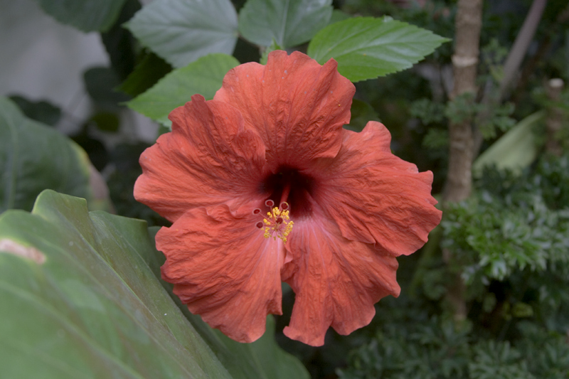</li>
        <li style="display: table-cell; list-style: none; vertical-align: middle; font-size: xx-large">+</li>
        <li style="display: table-cell; list-style: none; vertical-align: middle">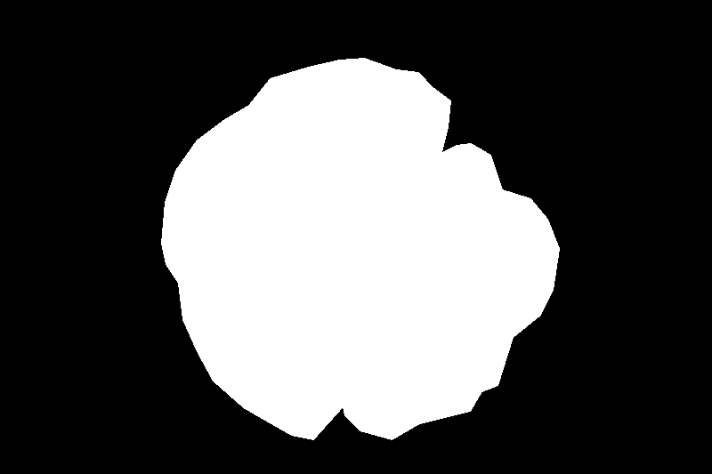</li>
        <li style="display: table-cell; list-style: none;  vertical-align: middle; font-size: xx-large">=</li>
        <li style="display: table-cell; list-style: none; vertical-align: middle">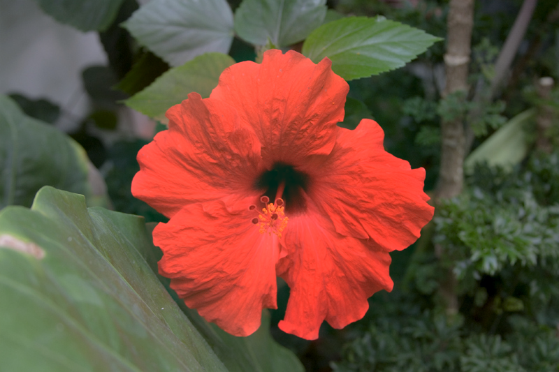</li>
    </ul>
    <h6>colorChange</h6>
</div>

## illuminationChange()
[illuminationChange()](https://docs.opencv.org/4.1.2/df/da0/group__photo__clone.html#gac5025767cf2febd8029d474278e886c7)在选择的图像的梯度域应用一个合适的非线性变换，然后结合泊松求解器(Poisson solver)，修改图像中亮度明显的区域。

C++
```c++
#include <opencv2/photo.hpp>
```  

```c++
void cv::illuminationChange	(	InputArray 	src,
InputArray 	mask,
OutputArray 	dst,
float 	alpha = 0.2f,
float 	beta = 0.4f 
)	
```

python

```python
dst	=	cv.illuminationChange(	src, mask[, dst[, alpha[, beta]]]	)
```

**参数:**
- **src**: 输入的3通道8bit图像
- **mask**: 遮罩，单通道或3通道的8bit图像
- **dst**: 输出图像，与输出图像的size和type一致
- **alpha**:亮度的缩放因子，默认是0.2， 取值范围[0, 2], 该值越大，亮度越低
- **beta**:亮度缩放后加上的参数，默认是0.4， 取值范围[0, 2]，该值越大，亮度越低

### 示例
```c++
illuminationChange(source, mask, result, 0.2f, 0.4f);
```

<div style="text-align: center; ">
    <ul style="display: table">
        <li style="display: table-cell; list-style: none; vertical-align: middle">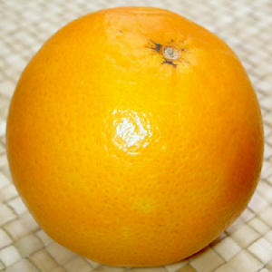</li>
        <li style="display: table-cell; list-style: none; vertical-align: middle; font-size: xx-large">+</li>
        <li style="display: table-cell; list-style: none; vertical-align: middle">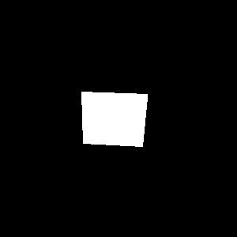</li>
        <li style="display: table-cell; list-style: none;  vertical-align: middle; font-size: xx-large">=</li>
        <li style="display: table-cell; list-style: none; vertical-align: middle">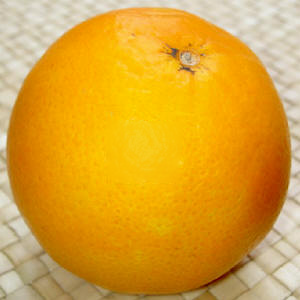</li>
    </ul>
    <h6>illuminationChange</h6>
</div>

## seamlessClone()
[seamlessClone()](https://docs.opencv.org/4.1.2/df/da0/group__photo__clone.html#ga2bf426e4c93a6b1f21705513dfeca49d),Seamless Cloning是实现是基于Poisson Image Editing论文的思想实现的，所以Seamless Cloning又称之为Poisson拷贝。Seamless Cloning的中心思想是在进行图片拷贝的时候拷贝的不是图像的像素值，而是图像的**梯度值(Gradients)**！Seamless Cloning使用了Poisson方程，又被称之为**泊松混合(Poisson Blending)**。Poisson Blending背后的计算过程如下:   
 1. 求取原图像和目标图像的x和y的偏导;
 2. 将原图像的偏导拷贝叠加到目标图像上偏导上；
 3. 在Dirichlet边界条件下对新的梯度图像积分；
 
 ```c++
 void cv::seamlessClone (InputArray src, InputArray dst, InputArray mask, Point p, OutputArray blend, int flags)
 ```
 
 **参数:**
 - **src**:被拷贝进目标图像的图像；
 - **dst**:目标图像；
 - **mask**:要克隆的图像区域的蒙版，不要去这个蒙版非常的精细，可以粗糙一点，如何图省事的话可是是全白；蒙版的size应该与src的size相同
 - **p**:原图像拷贝到目标图像的位置中心；
 - **blend**:混合后的输出图像
 - **flags**:克隆方法`cv::NORMAL_CLONE`、`cv::MIXED_CLONE`、`cv::MONOCHROME_TRANSFER`  
 
 
 枚举值 | 说明 
 :--------: | :--------:
 NORMAL_CLONE | 不保留dstination 图像的texture细节。目标区域的梯度只由源图像决定;The power of the method is fully expressed when inserting objects with complex outlines into a new background
 MIXED_CLONE | 目标区域的纹理(梯度)是由原图像和目的图像的组合计算出来(计算dominat gradient)。;The classic method, color-based selection and alpha masking might be time consuming and often leaves an undesirable halo. Seamless cloning, even averaged with the original image, is not effective. Mixed seamless cloning based on a loose selection proves effective.
 MONOCHROME_TRANSFER | 不保留src图像的颜色细节，只有src图像的质地，颜色和目标图像一样，可以用来进行皮肤质地填充。;Monochrome transfer allows the user to easily replace certain features of one object by alternative features.   
 
 
 ### 示例
 #### 1. NORMAL_CLONE
 ```c++
seamlessClone(source, destination, mask, p, result, NORMAL_CLONE);
```

<div style="text-align: center; ">
    <ul style="display: table">
        <li style="display: table-cell; list-style: none; vertical-align: middle"></li>
        <li style="display: table-cell; list-style: none; vertical-align: middle; font-size: xx-large">+</li>
        <li style="display: table-cell; list-style: none; vertical-align: middle"></li>
                <li style="display: table-cell; list-style: none; vertical-align: middle; font-size: xx-large">+</li>
        <li style="display: table-cell; list-style: none; vertical-align: middle">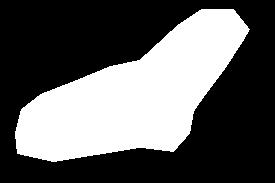</li>
        <li style="display: table-cell; list-style: none;  vertical-align: middle; font-size: xx-large">=</li>
        <li style="display: table-cell; list-style: none; vertical-align: middle"></li>
    </ul>
    <h6>NORMAL_CLONE(不保留dstination 图像的texture细节。目标区域的梯度只由src决定)</h6>
</div>

 #### 2. MIXED_CLONE
 ```c++
seamlessClone(source, destination, mask, p, result, MIXED_CLONE);
```

<div style="text-align: center; ">
    <ul style="display: table">
        <li style="display: table-cell; list-style: none; vertical-align: middle">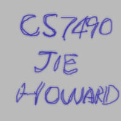</li>
        <li style="display: table-cell; list-style: none; vertical-align: middle; font-size: xx-large">+</li>
        <li style="display: table-cell; list-style: none; vertical-align: middle">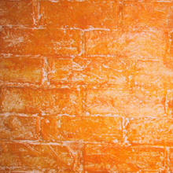</li>
                <li style="display: table-cell; list-style: none; vertical-align: middle; font-size: xx-large">+</li>
        <li style="display: table-cell; list-style: none; vertical-align: middle">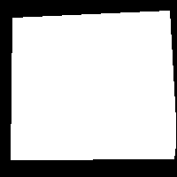</li>
        <li style="display: table-cell; list-style: none;  vertical-align: middle; font-size: xx-large">=</li>
        <li style="display: table-cell; list-style: none; vertical-align: middle">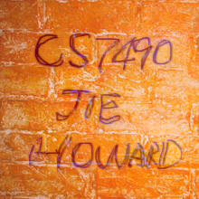</li>
    </ul>
    <h6>MIXED_CLONE(目标区域的纹理(梯度)是由原图像和目的图像的组合计算出来(计算dominat gradient))</h6>
</div>

 #### 3. MONOCHROME_TRANSFER;
 ```c++
seamlessClone(source, destination, mask, p, result, MONOCHROME_TRANSFER);
```

<div style="text-align: center; ">
    <ul style="display: table">
        <li style="display: table-cell; list-style: none; vertical-align: middle">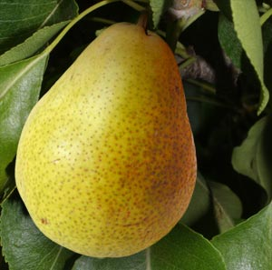</li>
        <li style="display: table-cell; list-style: none; vertical-align: middle; font-size: xx-large">+</li>
        <li style="display: table-cell; list-style: none; vertical-align: middle">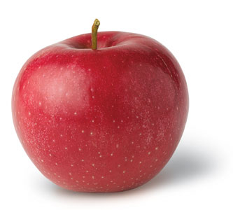</li>
                <li style="display: table-cell; list-style: none; vertical-align: middle; font-size: xx-large">+</li>
        <li style="display: table-cell; list-style: none; vertical-align: middle">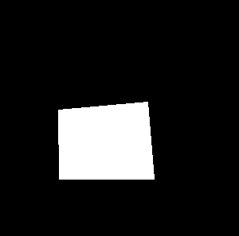</li>
        <li style="display: table-cell; list-style: none;  vertical-align: middle; font-size: xx-large">=</li>
        <li style="display: table-cell; list-style: none; vertical-align: middle">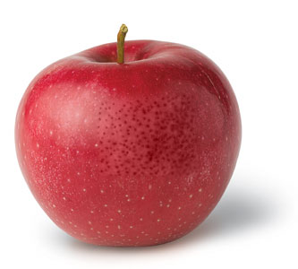</li>
    </ul>
    <h6>Monochrome_Transfer(不保留src图像的颜色细节，只有src图像的质地，颜色和目标图像一样，可以用来进行皮肤质地填充)</h6>
</div>

## textureFlattening()
[textureFlattening()](https://docs.opencv.org/4.1.2/df/da0/group__photo__clone.html#gad55df6aa53797365fa7cc23959a54004)主要用于去除选定区域的纹理，使选定区域变得平坦，与此同时保留边缘位置的梯度。该方法内部使用Canny进行边缘检测。

C++
```c++
#include <opencv2/photo.hpp>
```  

```c++
void cv::textureFlattening	(	InputArray 	src,
InputArray 	mask,
OutputArray 	dst,
float 	low_threshold = 30,
float 	high_threshold = 45,
int 	kernel_size = 3 
)		
```

python
```python
dst	=	cv.textureFlattening(	src, mask[, dst[, low_threshold[, high_threshold[, kernel_size]]]]	)

```

**参数:**
- **src**: 输入的3通道8bit图像
- **mask**: 遮罩，单通道或3通道的8bit图像
- **dst**: 输出图像，与输出图像的size和type一致
- **low_threshold**: Canny边缘检测的后验阈值，默认是30，取值范围为[0, 100]
- **high_threshold**: Canny边缘检测的后验阈值，默认是45，取值范围为(100, +∞)
- **kernel_size**: Sobel核的尺寸

**注意:**  
> 该算法假设源图像的颜色接近目标图像的颜色,这种假设意味着，当颜色不匹配时，源图像的颜色将变为目标图像的颜色

### 示例
```c++
textureFlattening(source, mask, result, 30, 45, 3);
```
<div style="text-align: center; ">
    <ul style="display: table">
        <li style="display: table-cell; list-style: none; vertical-align: middle">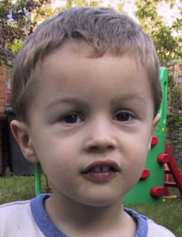</li>
        <li style="display: table-cell; list-style: none; vertical-align: middle; font-size: xx-large">+</li>
        <li style="display: table-cell; list-style: none; vertical-align: middle">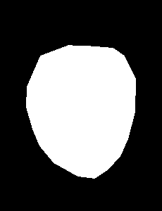</li>
        <li style="display: table-cell; list-style: none;  vertical-align: middle; font-size: xx-large">=</li>
        <li style="display: table-cell; list-style: none; vertical-align: middle">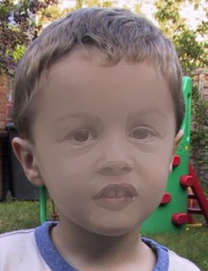</li>
    </ul>
    <h6>textureFlattening</h6>
</div>

## 示例代码
[import](../../src/ProjectsCpp/PhotoModule/SeamlessClone/PM_seamless_cloning.cpp)
