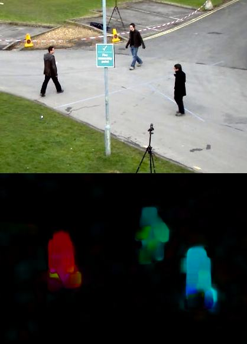

# 光流(Optical Flow)
- 光流的概念及其使用Lucas-Kanade方法的估算
- 使用[`cv.calcOpticalFlowPyrLK()`](https://docs.opencv.org/4.1.2/dc/d6b/group__video__track.html#ga473e4b886d0bcc6b65831eb88ed93323)之类的函数来跟踪视频中的特征点
- 用[`cv.calcOpticalFlowFarneback()`](https://docs.opencv.org/4.1.2/dc/d6b/group__video__track.html#ga5d10ebbd59fe09c5f650289ec0ece5af)方法创建一个稠密光流场

## 光流
[光流](https://zh.wikipedia.org/wiki/%E5%85%89%E6%B5%81%E6%B3%95)是关于视域中的物体运动检测中的概念。用于描述相对于观察者或被观察对象运动所造成的观测目标、表面或边缘的运动。在样行识别、计算机视觉和影像处理领域非常有用，可用于运动检测、物体切割、碰撞时间和物体膨胀的计算、运动补码或者通过物体表面与边缘进行立体的测量等等。  

    

  

上图是一个球体在连续的5帧图像的运动，箭头显示其位移向量。光流有许多用途，例如： 
- 运动检测/结构化
- 视频压缩
- 视频稳定

光流的工作基于以下几个假设：
1. 物体的像素强度在连续的帧之间不改变
2. 相邻像素具有相似的运动

光流法实际是通过检测图像像素点的强度随时间的变化进而推断出物体移动速度及方向的方法。  
假设该移动很小，那么可以根据泰勒级数得出：  
$$
    I(x+{\Delta}x, y+{\Delta}y, t+{\Delta}t) = I(x, y, t) + \frac {\partial I}{\partial x} {\Delta x} + \frac {\partial I}{\partial y} {\Delta y} + \frac {\partial I}{\partial t} {\Delta t}
$$

因此可以得出:  
$$
\frac {\partial I}{\partial x} {\Delta x} + \frac {\partial I}{\partial y} {\Delta y} + \frac {\partial I}{\partial t} {\Delta t} = 0
$$
或:   
$$
\frac {\partial I}{\partial x} \frac {\Delta x}{\Delta t} + \frac {\partial I}{\partial y} \frac {\Delta y}{\Delta t} + \frac {\partial I}{\partial t} \frac {\Delta t}{\Delta t} = 0
$$  
最终可以得出结论:  
$$
    f_x u + f_y v + f_t = 0
$$
其中: 
$$
    \begin{aligned}
    &f_x=\frac{\partial f}{\partial x}; f_y = \frac{\partial f}{\partial y} \\
    &u=\frac{d x}{d t}; v = \frac{d y}{d t}
    \end{aligned}
$$

上述方程式称为光流方程式。在其中，我们可以计算出$$f_x$$和$$f_y$$，它们是图像梯度。同样，$$f_t$$是随时间变化的梯度。但是（$$u$$，$$v$$）是未知的。我们不能用两个未知变量来求解这个方程。因此，提供了几种解决此问题的方法，其中一种是Lucas-Kanade。

### Lucas-Kanade method
之前我们已经假设，所有相邻像素将具有相似的运动.Lucas-Kanade从这个点的周围取一个3x3的图块。所以这9个点应该具有同样的运动。我们可以轻松计算出这9个点的($$f_x$$, $$f_y$$, $$f_t$$). 所以现在我们的问题变成了求解带有两个未知变量的9个方程.用最小二乘拟合法可获得更好的解决方案。下面是最终的解决方案，它是两个方程式-两个未知的问题，并求解以获得解决方案:  
$$
\begin{bmatrix} u \\ v \end{bmatrix} = \begin{bmatrix} \sum_{i}{f_{x_i}}^2 & \sum_{i}{f_{x_i} f_{y_i} } \\ \sum_{i}{f_{x_i} f_{y_i}} & \sum_{i}{f_{y_i}}^2 \end{bmatrix}^{-1} \begin{bmatrix} - \sum_{i}{f_{x_i} f_{t_i}} \\ - \sum_{i}{f_{y_i} f_{t_i}} \end{bmatrix}
$$

（用Harris拐角检测器检查逆矩阵的相似性。这表示拐角是更好的跟踪点。）

因此，从用户的角度来看，这个想法很简单，我们给一些点进行跟踪，然后得到这些点的光流矢量。但是同样存在一些问题。到现在为止，我们只处理一些小的运动，所以在大动作时就失效了。为了解决这个问题，我们使用金字塔图像。当我们上金字塔时，较小的动作将被删除，较大的动作将变为较小的动作。因此，通过在此处应用Lucas-Kanade，我们可以随着尺度获得光流。

## OpenCV中Lucas-Kanade光流

OpenCV在单个函数[`cv.calcOpticalFlowPyrLK()`](https://docs.opencv.org/4.1.2/dc/d6b/group__video__track.html#ga473e4b886d0bcc6b65831eb88ed93323)中提供所有这些功能。在这里，我们创建一个简单的应用程序来跟踪视频中的某些点。我们使用[`cv.goodFeaturesToTrack()`](https://docs.opencv.org/4.1.2/dd/d1a/group__imgproc__feature.html#ga1d6bb77486c8f92d79c8793ad995d541)来确定这些追踪点。我们采用第一帧，检测其中的一些Shi-Tomasi角点，然后使用Lucas-Kanade光流迭代地跟踪这些点。对于函数[`cv.calcOpticalFlowPyrLK()`](https://docs.opencv.org/4.1.2/dc/d6b/group__video__track.html#ga473e4b886d0bcc6b65831eb88ed93323)，我们传递前一帧，之前的点和下一帧。它返回下一个点以及一些状态编号，如果找到下一个点，则状态值为1，否则返回零。我们以迭代方式将这些下一个点作为下一步中的上一个点传递。请参见下面的代码： 

[import](../../src/ProjectsCpp/VideoAnalysis/OpticalFlow/VA_optical_flow.cpp) 

    

  

此代码不会检查下一个关键点的正确性。因此，即使任何特征点在图像中消失了，光流也有可能找到下一个看起来可能与它接近的下一个点。因此，实际上，对于可靠的跟踪，应该以特定的时间间隔检测点。OpenCV样本附带了这样一个样本，该样本每5帧就找到一个特征点，并且还对光流点进行了后向检查，以仅选择良好的流点。 

## OpenCV中的稠密光流
Lucas-Kanade方法计算稀疏特征集的光流（在我们的示例中为使用Shi-Tomasi算法检测到的角）。 OpenCV提供了另一种算法来查找密集的光流。它计算帧中所有点的光通量。它基于Gunner Farneback的算法，在2003年Gunner Farneback的“基于多项式展开的两帧运动估计”中对此进行了解释。  

下面的示例显示了如何使用上述算法找到密集的光流。我们得到一个带有光流矢量（$$u$$，$$v$$）的2通道阵列。我们找到了它们的大小和方向。我们对结果进行颜色编码以实现更好的可视化。方向对应于图像的色相值。幅度对应于值平面。请参见下面的代码： 

[import](../../src/ProjectsCpp/VideoAnalysis/OpticalFlow/VA_optical_flow_dense.cpp)

    

  

